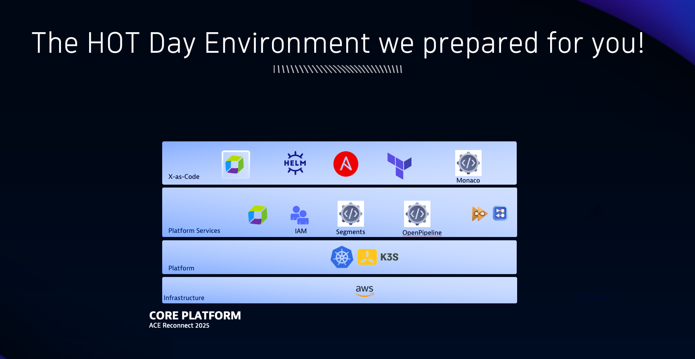

## Intro

Imagine you're stepping into a real world engagement with a customer who is preparing to migrate from  gen 2 to the gen 3 platform. The main question is "what do I need to do"? 

The customer has a Kubernetes cluster running two applications:
- Easytrade – a trading platform with multiple microservices
- Hipstershop – a demo e-commerce app used for observability testing

These apps are deployed across different namespaces and environments, and your mission is to help the customer modernize their observability strategy using Gen 3 capabilities.

What to Expect?
Throughout the labs, you’ll take on the role of a Dynatrace expert working directly with the customer. Each lab represents a critical phase of the migration journey, and by completing them, you’ll gain hands-on experience with:
- Extracting and enriching metadata
- Designing and implementing scalable IAM strategy
- Creating precise data filters using Segments
- Partitioning logs for performance and cost efficiency
- Allocating observability costs across teams and services

Environment setup:

