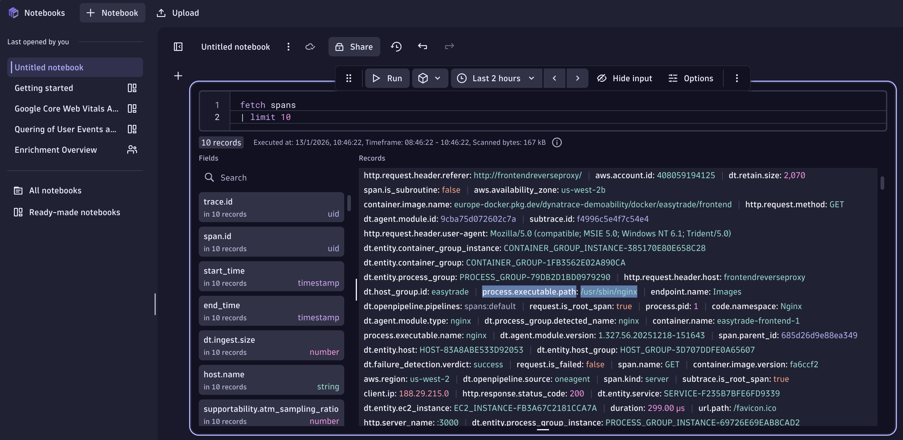
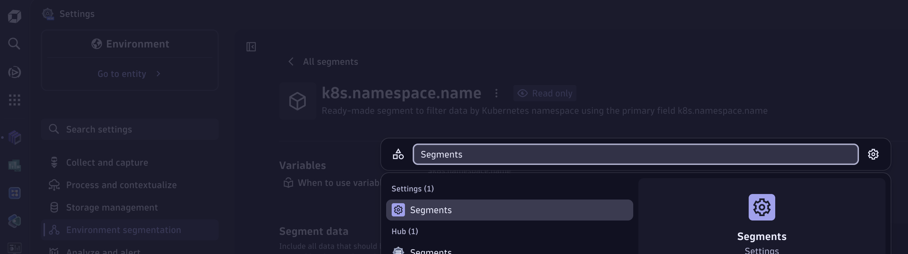
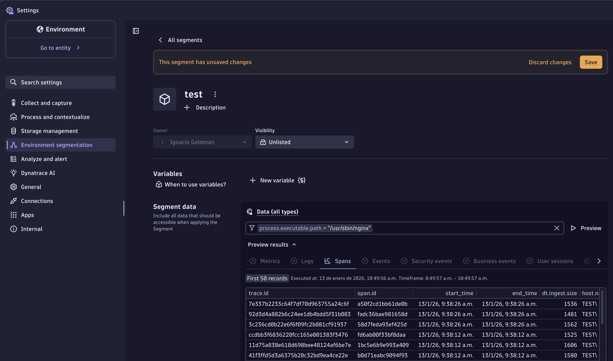
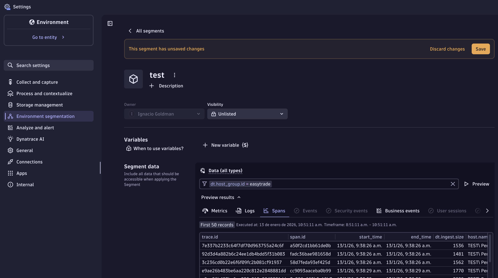

## Objective

During this lab, we will help the Easytrade application team upgrade their Dynatrace Observability solution. The team has previously configured their tenant with the following features:
- Auto-tags and management zones for filtering and access control
- Classic dashboards
- Alerting

They use the platform to find bugs, improve user experience, and detect anomalies across their applications and infrastructure.

To meet their requirements, we will upgrade these features to their equivalents in the Dynatrace 3rd Gen Platform:
- Segments
- Dashboards
- Alerting

This lab goes beyond a one-to-one feature mapping. In addition to migrating existing capabilities, we will demonstrate the added value of the Dynatrace 3rd Gen Platform—showing how these new features enable deeper insights, greater flexibility, and more efficient workflows compared to the classic approach.

Let’s get started!

### Warm Up

1. Open your Dynatrace environment, open a new notebook, and click the _plus_ icon to write a DQL to fetch one span. This is how you can check all fields and metadata available for a signal, as shown here as a record.

```sql
fetch spans
| limit 10
```

Change the view to "Record list" to have a nice overview of all fields. You can do this by clicking on `Options->Record list` on the DQL tile.



2. Copy the value of the `process.executable.path` property for a record that contains one, you can increase the `limit 10` if you can't find one.

3. Open the Segments settings by searching for Segments using the search bar in the top left menu bar



Dynatrace segments are a way to organize and manage groups of monitored entities within your environment, such as hosts, services, or applications, based on shared characteristics or business logic. They allow you to define logical partitions that reflect your organizational structure, operational responsibilities, or specific use cases, making it easier to apply consistent settings, permissions, and monitoring configurations across related components. By using segments, teams can streamline governance, simplify data filtering, and ensure that monitoring aligns with business priorities.

4. Create a new Segment, and filter Data (all types) with the java.jar.path. E.g.

```bash
process.executable.path = "/usr/sbin/nginx"
```



See how `process.executable.path` is just available for spans? not quite a good fit for a tenant-wise configuration

5. Now let's use `dt.host_group.id` to filter Data (all types). E.g.

```bash
dt.host_group.id = easytrade
```

Click on the Metrics/Logs/Events tab. Notice how the metadata is available on all signals, hence it's a very good fit for a tenant-wise configuration.



## Close Up & Next Challenge

Well done, hopefully now you understand the importance of Primary Grail Fields

During the next lab, we will learn how we can easily enrich with other useful Primary Grail Fields directly from the Dynatrace tenant.

| Primary Grail Field / Tag | Assigned Value | Purpose / Intended Use |
|---------------------------|----------------|------------------------|
| host group                | easytrade      | manage OA as groups, entity modeling, classic enrichement |
| dt.security_context       | easytrade      | data access            |
| dt.cost.costcenter        | ecommerce-apps | cost allocation        |
| dt.cost.product           | easytrade      | cost allocation        |