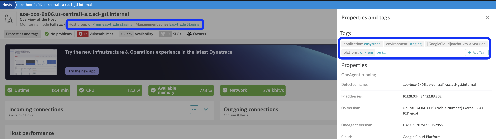
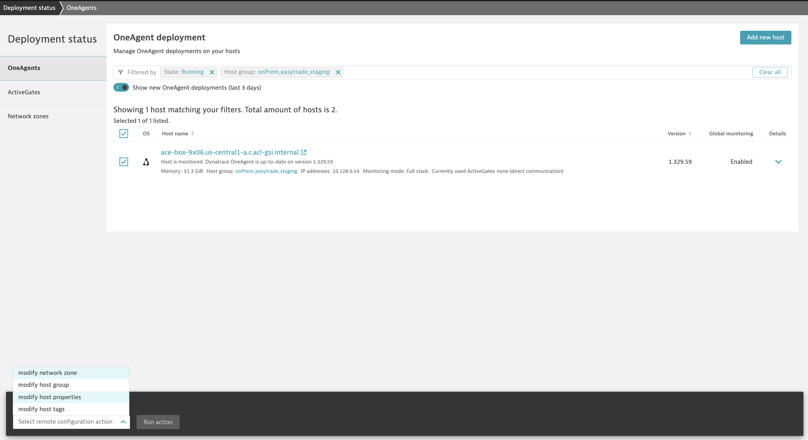
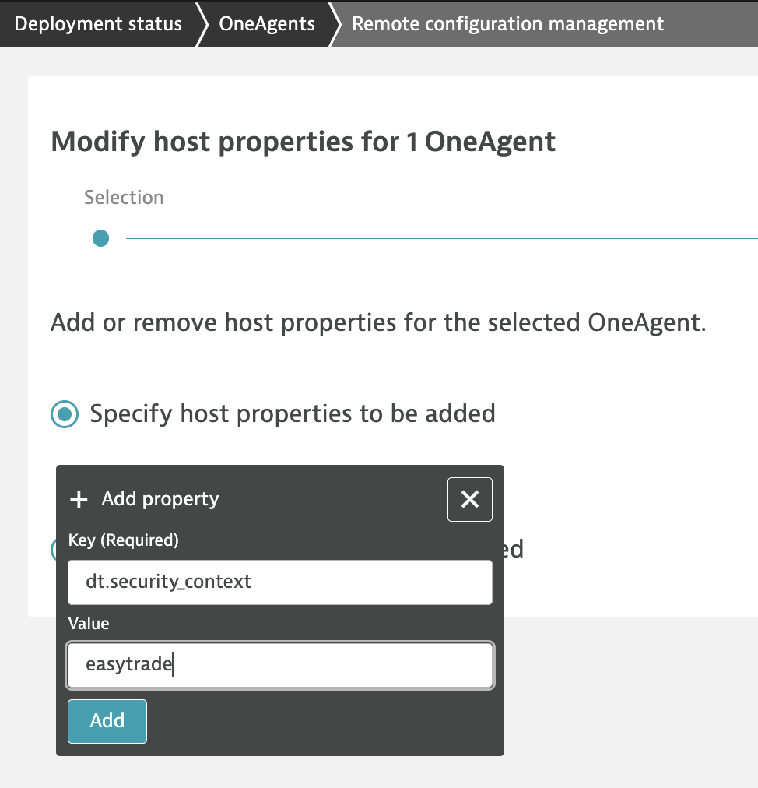

## Enrichment at Source

The team are using auto-tags & management zones for filtering & access control in their Dynatrace classic platform. A very common setup was to rely on the values provided with the host group, to configure auto-tags, and Management Zones based on them.

There are special "fields" we recommend to use in Segments that are called Primary Grail Field, Host Group is one of them. We will show you how to add other relevant Primary Grail Fields (and Tags) directly from the Dynatrace Environment.

1. Go to the `Deployment Status` page within the Dynatrace tenant, filter by the host group of the team (`onPrem_easytrade_staging`), click on all the hosts (just 1 for us), modify host properties, and click on `Run action`

2. Let's define additional properties, depending the use case:

| Primary Grail Field / Tag | Assigned Value | Purpose / Intended Use |
|---------------------------|----------------|------------------------|
| dt.security_context       | easytrade      | data access            |
| dt.cost.costcenter        | ecommerce-apps | cost allocation        |
| dt.cost.product           | easytrade      | cost allocation        |
| primary_tags.environment  | staging        | filtering              |
| primary_tags.application  | easytrade      | filtering              |
| primary_tags.platform     | onPrem         | filtering              |

2. Defining host groups usually was a practice to slice and dice our environment based on certain criteria, let's adapt those properties for 3rd Gen, let's define the following host properties
    - dt.security_context: easytrade
    - dt.cost.costcenter: ecommerce-apps
    - dt.cost.product: easytrade
    - primary_tags.environment: staging
    - primary_tags.team: alpha
    - primary_tags.app: easytrade
    - primary_tags.platform: onPremDedicated

3. Wait a few minutes

SCREENSHOT

4. See how works automatically for logs

SCREENSHOT

5. For traces, we need to restart the app. Restart easytrade with the following command

COMMAND

SCREENSHOT

6. Check how Enrichment works for traces

SCREENSHOT

## Close Up

You could easily start implementing this in your classic environments to slice & dice the data, to be ready for 3rd Gen.

If you need further granularity, e.g. at process level, you can define the properties as environment variables for the process running on it. E.g. for a container:

broker-service:
    <<: *default-service
    image: ${REGISTRY}/broker-service:${TAG}
    depends_on:
      - db
      - accountservice
      - pricing-service
      - feature-flag-service
    environment:
      ACCOUNTSERVICE_HOSTANDPORT: accountservice:8080
      PRICINGSERVICE_HOSTANDPORT: pricing-service:8080
      ENGINE_HOSTANDPORT: engine:8080
      <<: *feature-flag-service-env
      PROXY_PREFIX: broker-service
      MSSQL_CONNECTIONSTRING: *dotnet-connection-string
      OTEL_RESOURCE_ATTRIBUTES: "dt.security_context=brokerservice,dt.cost.costcenter=brokerservice,dt.cost.product=brokerservice, primary_tags.team=beta, primary_tags.stage=prod"
      DT_TAGS: "dt.security_context=brokerservice,dt.cost.costcenter=brokerservice,dt.cost.product=brokerservice, primary_tags.team=beta, primary_tags.stage=prod"

If you have hundred of host groups and you would like to automate the process, contact us and we can provide you some some scripts to help!

If you're running in K8s or Cloud environments, there are special enrichment mechanisms that will grab the metadata directly from the source, which could reduce efforts!. 
- https://docs.dynatrace.com/docs/ingest-from/setup-on-k8s/guides/metadata-automation/k8s-metadata-telemetry-enrichment
- https://docs.dynatrace.com/docs/whats-new/preview-releases#new-cloud-aws
