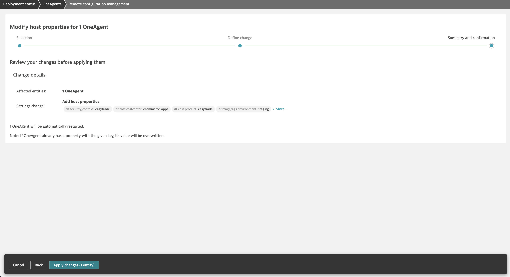
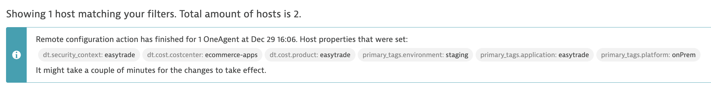
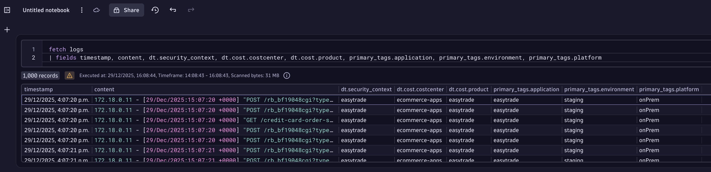
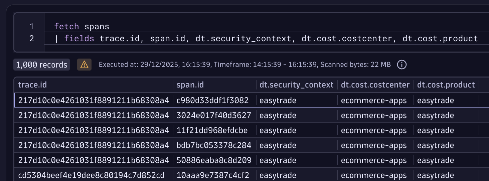
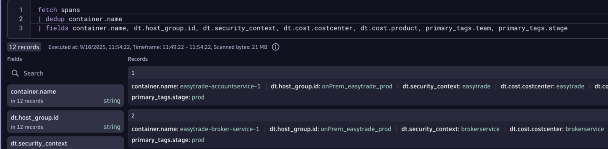

## Enrichment at Source

The team is using auto-tags and management zones for filtering and access control in their Dynatrace Classic platform. A very common setup was to rely on the values provided by the host group to configure auto-tags and management zones.


In our new approach, Segments, there are special fields that we recommend using: Primary Grail Fields. Host Group is one of these fields. We will show you how to add other relevant Primary Grail Fields (and tags) directly from the Dynatrace environment.

1. Go to the `Deployment Status` application within the Dynatrace tenant, filter by the team’s host group (`easytrade`), select all hosts (only one in our case), choose **Modify host properties**, and click `Run action`.


2. Let's define additional properties, depending on the use case:

| Primary Grail Field / Tag | Assigned Value | Purpose / Intended Use |
|---------------------------|----------------|------------------------|
| dt.security_context       | easytrade      | data access            |
| dt.cost.costcenter        | ecommerce-apps | cost allocation        |
| dt.cost.product           | easytrade      | cost allocation        |

<div align="left">

</div>

> Note: you can also add filtering Primary Grail Tags with the following format: `primary_tags.<key>`, for a filtering purpose. E.g. primary_tags.environment=staging

3. Fill the configuration with all properties, and apply changes



4. Wait a few minutes



5. Go to the Notebooks application and create a new Notebook by clicking ** + Notebook **. Run the following DQL in a new tile in order to check if the logs are enriched:

```shell
fetch logs
| fields timestamp, content, dt.security_context, dt.cost.costcenter, dt.cost.product
| limit 5
```



5. For traces, we need to restart the app. Navigate to the correct directory: Restart easytrade with the following commands in the terminal provided in Dynatrace University.

```shell
cd /opt/easytrade
```

6. Restart easytrade with the following commands in the terminal provided in Dynatrace University. When password for the box is requested, you can find that on this page as well. 

```shell
sudo docker compose restart
```

7. Check how Enrichment works for traces using the below DQL in a new tile on the same Notebook

```shell
fetch spans
| fields trace.id, span.id, dt.security_context, dt.cost.costcenter, dt.cost.product
| limit 5
```



If you have hundreds of host groups and you would like to automate the process, contact us and we can provide you with a script that you can leverage!

### Shared Infrastructure

If you have shared infrastructure and you need different properties for the apps running on the hosts, you can define them as environment variables, or in a future release, Dynatrace will allow to configure source enrichment directly from the tenant.

Environment variables match with a declarative practice for whoever owns the resource, in order to find them in Dynatrace. The counterpart is the manual labor, in that case, you can rely on Dynatrace configs otherwise.

Example: 

```yaml
broker-service:
    <<: *default-service
    image: ${REGISTRY}/broker-service:${TAG}
    depends_on:
      - db
      - accountservice
      - pricing-service
      - feature-flag-service
    environment:
      ACCOUNTSERVICE_HOSTANDPORT: accountservice:8080
      PRICINGSERVICE_HOSTANDPORT: pricing-service:8080
      ENGINE_HOSTANDPORT: engine:8080
      <<: *feature-flag-service-env
      PROXY_PREFIX: broker-service
      MSSQL_CONNECTIONSTRING: *dotnet-connection-string
      DT_TAGS: "dt.security_context=brokerservice,dt.cost.costcenter=brokerservice,dt.cost.product=brokerservice, primary_tags.team=beta, primary_tags.stage=prod"
```



### Other Technologies?

If you're running in K8s or Cloud environments, there are special enrichment mechanisms that will grab the metadata directly from the source, which could reduce efforts!. 
- [K8s](https://docs.dynatrace.com/docs/ingest-from/setup-on-k8s/guides/metadata-automation/k8s-metadata-telemetry-enrichment)
- [Cloud](https://docs.dynatrace.com/docs/whats-new/preview-releases#new-cloud-aws)

### Reference

Reference to Dynatrace public documentation [here](https://docs.dynatrace.com/docs/manage/segments/upgrade-guide-segments)

### Closing Up

Now that our data in enriched with the right fields, we can proceed to configure Segments. Segments will replace the filtering capability of Management Zones
