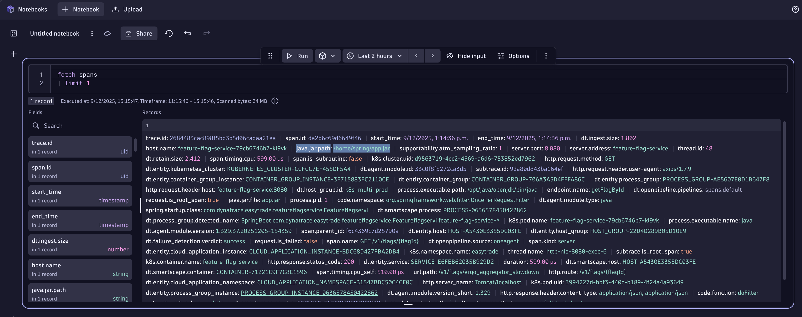
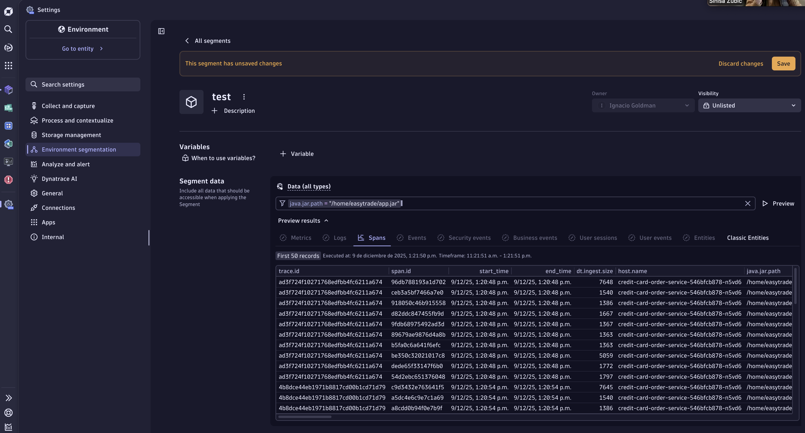
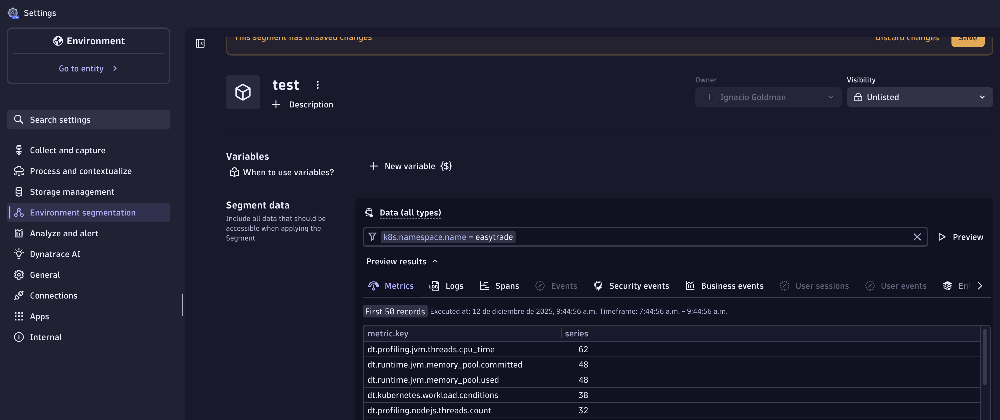
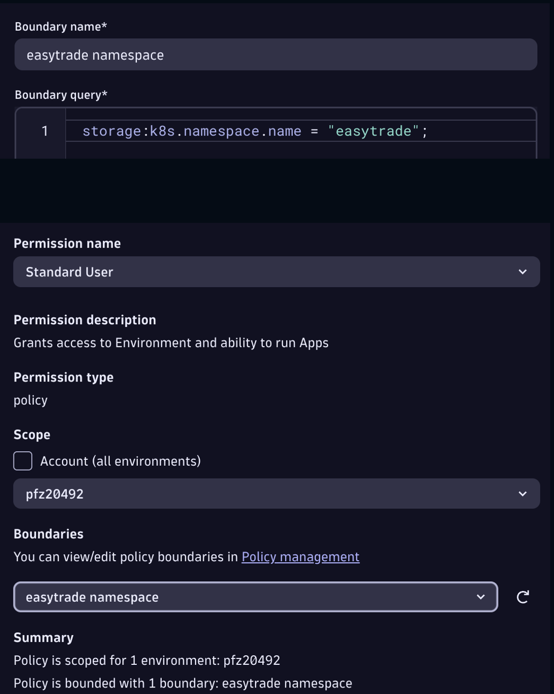

## Introduction & Primary Grail Fields (10min)

## Introduction

You're responsible for executing the Proof-of-Concept for a new application onboarded into Dynatrace called "Easytrade".

## Warm Up

1. Open your Dynatrace environment, open a new notebook, and click the _plus_ icon to write a DQL to fetch one span. This is how you can check all fields and metadata available for a signal, as shown here as a record.

```sql
fetch spans
| limit 1
```

Change the view to "Record list" to have a nice overview of all fields. You can do this by clicking on Options->Record List on the DQL tile.




2. Copy the value of the java.jar.path property.

3. Open the Segments settings by searching for Segments using the search bar in the top left menu bar


4. Create a new Segment, and filter Data (all types) with the java.jar.path. E.g.

```bash
java.jar.path = "/home/easytrade/app.jar" 
```



See how java.jar.path is just available for spans? not quite a good fit for a tenant-wise configuration

5. Now let's use k8s.namespace.name to filter Data (all types). E.g.

```bash
k8s.namespace.name = "easytrade"
```

Click on the Metrics tab. See how the metadata is available in all signals, a good fit for a tenant-wise configuration



## Close Up & Next Challenge

Well done, hopefully now you understand the importance of Primary Grail Fields

With OOTB permission relevant Primary Grail Fields, you could directly configure IAM to give access to each team to their own namespace. The boundary and policy would look as follows



This is the most simple scenario, but what if namespace is not enough to meet our requirements? E.g.

- there are other underlying technologies apart from k8s
- we should use app IDs defined in a k8s label
- needed higher granularity
- cost allocation is a must

### "there are other underlying technologies apart from k8s"

Teams under K8s are relying on k8s.namespace, but there are teams building apps on premise, and serverless.

As of today, we recommend using a common metadata structure and defining three key attributes:
- dt.security_context
- dt.cost.costcenter
- dt.cost.product

Back to the presentation!
