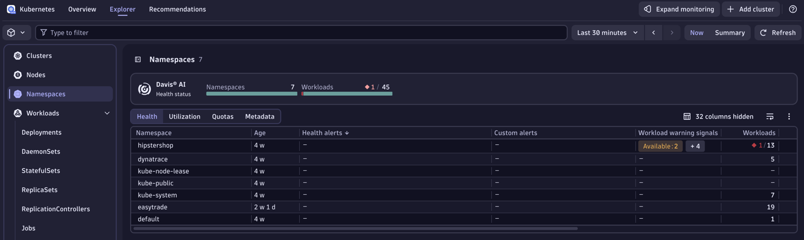
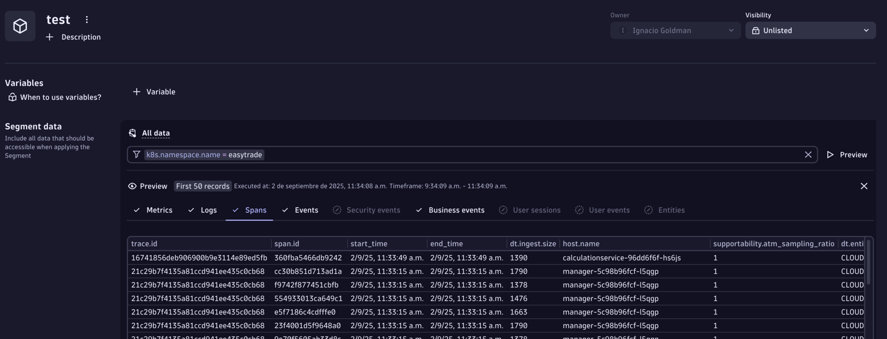
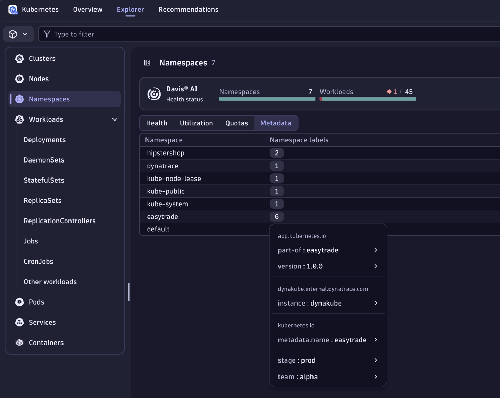
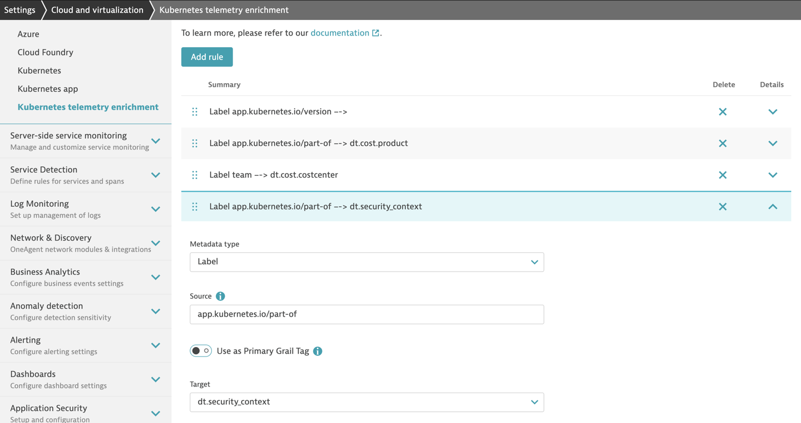
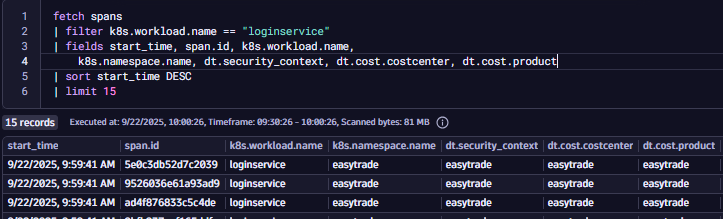
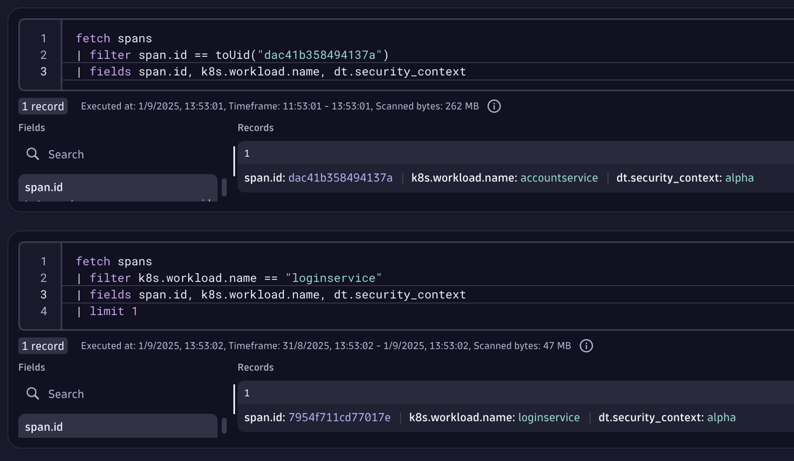

## Metadata Enrichment

### 🎯 Objectives
All participants will enrich observability data (entities, metrics, events, logs, etc.) with metadata fields such as:
- `dt.security_context`
- `dt.cost.costcenter`
- `dt.cost.product`
> The idea is to explore different enrichment strategies using Kubernetes and understand trade offs between approaches.

#### 📋 Step 1: Understand Why Metadata Enrichment Matters
💡 Enrichment helps with access control, cost allocation, segmentation, and governance. We are trying to make sure that observability data is tagged with meaningful context.

Key Enrichment Targets:
- Entities (e.g., services, workloads)
- Metrics
- Events
- Logs
- Traces

  
🧠 Questions to consider:
- What metadata do you need to enrich your data with?
- What level of granularity is required—namespace or workload?
- Do you want enrichment to be automatic, declarative, or manual?
- How will this metadata be used for IAM, cost control, and segmentation?


#### 🛠️ Step 2: Explore Enrichment Strategies
🧪 Use the guide: [Enrichment Kubernetes](https://dt-rnd.atlassian.net/wiki/spaces/d1coe/pages/1229849653/Enrichment+Kubernetes)

✅ **Option 1**: Rely on Primary Grail Fields
Fields:
- `k8s.namespace.name`
- `k8s.cluster.name`

| Pros	| Cons	| Use when |
| ------ | ------ | ------ |
| Out-of-the-box (OOTB)|	Limited granularity | Quick setup is needed	| 
| No configuration needed |	 Only namespace-level |	Simple IAM and segmentation	|

---

🟡 **Option 2**: Use [Namespace Annotations & Labels](https://docs.dynatrace.com/docs/ingest-from/setup-on-k8s/guides/metadata-automation/k8s-metadata-telemetry-enrichment)

How it works? Dynatrace Operator converts namespace-level metadata into enrichment fields.

| Pros	| Cons	| Use when |
| ------ | ------ | ------ |
| Declarative |	Only applies at namespace level | Customer follows cloud-native tagging practices	| 
| Moderate effort |	 Requires Dynatrace configuration |	Needs more flexibility than OOTB fields	|
| Supports custom Primary Grail Tags |  | |

---

🔴 **Option 3**: Set Manual Pod Annotations

How it works? Manually add annotations to pod definitions (e.g., in deployment YAML)

| Pros	| Cons	| Use when |
| ------ | ------ | ------ |
| Maximum granularity (workload-level) |	Requires code changes | Need to segregate access or cost at workload level	| 
| Full control over enrichment |	 Higher effort |	Namespace-level granularity is not enough	|

---

#### Summary Table

| Approach	| Effort	|Granularity |	Flexibility |	Best For |
| ------ | ------ | ------ | ------ | ------|
| Primary Grail Fields|	🟢 Low | Namespace	| 🔴 Limited | 	Quick IAM & Segments setup |
| Namespace Annotations/Labels |	🟡 Medium |	Namespace	| 🟡 Moderate	| Declarative tagging, cloud-native orgs |
| Manual Pod Annotations	| 🔴 High	| Workload | 🟢 Maximum	| Fine-grained control, cost partitioning|


#### 🧩 Step 3: Try It Out

Complete enrichment using all strategies.

**Task 1: Automatic Enrichment via Kubernetes Metadata**
Dynatrace automatically enriches telemetry data with Kubernetes metadata such as:
- `k8s.cluster.name`
- `k8s.namespace.name`


> Kubernetes Cluster namespaces

**Instructions:**
1. Open Dynatrace and navigate to Segments.
2. Create a new segment based on k8s.namespace.name.
3. Use this segment to filter the two applications deployed in separate namespaces.
4. Observe how Dynatrace uses this metadata to group and contextualize your services.

> 💡 Tip: This is useful for OOTB IAM and Segment configurations.


> Kubernetes Namespace-based segment

If this is not enough and you'd like to go further and you require more configuration possibilities. Let's explore the enrichment strategy at source. You can enrich data by adding custom labels and annotations to your Kubernetes manifests. Dynatrace will pick these up and use them for tagging and filtering.

**Task 2: Automatic Enrichment via Kubernetes Metadata at Source**

You should ultimately enrich your deployment with:
- `dt.security_context`
- `dt.cost.costcenter`
- `dt.cost.product`


How to do that you might ask? Well... Let's look at how customers manage modern cloud environments. In modern cloud-native environments, cloud tags, Kubernetes labels and namespaces classify systems using various aspects, like cost allocation, access control, application, and owner. In such environments, configuration-as-code principles are well established, including defining such tags as part of the system configuration.

In K8s, annotations and labels are both key-value pairs used to attach metadata to objects like Pods, Services, and Deployments. Customers following cloud-native tagging best practices will define their partitioning with labels & annotations, as follows:



You can use the K8s Enrichment settings to transform labels & annotations into `dt.security_context`, `dt.cost.costcenter`, `dt.cost.product`.

1. Go to Settings > Topology Model > Grail security context for monitored entities 
2. Filter by `dt.entity.cloud_application_namespace`
3. Change destination property from Management Zone to `dt.security_context`
4. Go to your Kubernetes cluster > Settings > Telemetry Enrichment 
5. Add a rule:
  - Metatadata type = Label
  - Source = kubernetes.io/metadata.name
  - Primary grail tag = false
  - Target = `dt.security_context`

All of these steps are required in order to add additional topology enrichment for K8s. In order for the rule to work, we need to keep in mind 3 things:
- New rules may take up to 45 minutes to become effective.
- After the rules are applied, pod restarts are required to ensure the changes take effect.

You can use this command - `kubectl rollout restart deployment -n easytrade`




> 💡 How it works? The Dynatrace Operator will take care of the enrichment when mutating the pod definition



**Example**

- **Namespace**:easytrade
- **Pod**:accountservice

Enrichment via Pod Annotation:
```
metadata:
  annotations:
    dt.security_context: "easytrade"
    dt.cost.costcenter: "platform"
    dt.cost.product: "accountservice"

```

Apply with:
```
kubectl apply -f accountservice.yaml -n easytrade
```

**Task 3: Manual Pod Annotation for Granularity**
If you need workload-level granularity, manual annotations are required. Check the picture below where our accountservice doesn't have the proper enrichment.



Update your deployment manifest:

```
metadata:
  annotations:
    metadata-enrichment.dynatrace.com/inject: "true"
    metadata.dynatrace.com/dt.security_context: "easytrade"
    metadata.dynatrace.com/dt.cost.costcenter: "platform"
    metadata.dynatrace.com/dt.cost.product: "accountservice"

```

Apply with:

```
kubectl apply -f /path/to/accountservice.yaml -n easytrade
```

> Result

> ⚠️ Notes
> - Namespace-level enrichment is easier but less granular.
> - Workload-level enrichment gives full control but requires manual effort.
> - Without proper annotations, filtering and cost allocation may be limited.


OLD STRUCTURE - keeping it for now
### Objectives

1. Participants need to enrich with dt.security_context, cost center, cost product, following this guide: (Dedicated Infrastructure enrichment): https://dt-rnd.atlassian.net/wiki/spaces/d1coe/pages/1229849653/Enrichment+Kubernetes

2. Learn the importance of Primary Grail Fields, in this case the host group. https://dt-rnd.atlassian.net/wiki/spaces/d1coe/pages/1246757730/2.+Metadata+Enrichment
    - difference between host group with java.jar.file

3. Talk about bare-metal, OTEL_RESOURCE_ATTRIBUTE
