## Management Zones to Segments

The team uses an `Easytrade` Management Zone to move across the environment and find their relevant entities. For example the team is using the Management Zone to find their relevant services, to spot performance degradations

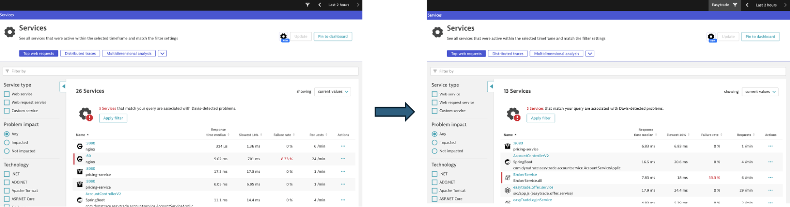

The distributed traces view is another interesting one for the team, to find relevant failed requests & exceptions, and later convert them into metrics & alerts in case necessarely

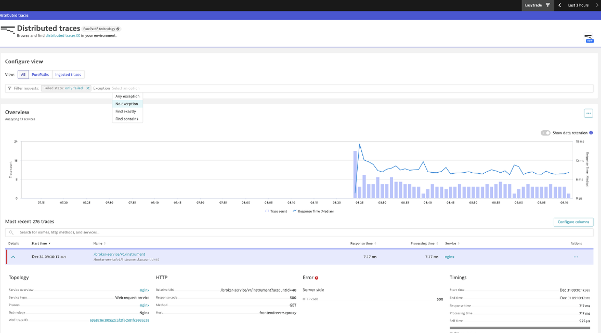

Segments are the equivalent capability in 3rd Gen, and along with Enrichment at Source, they bring some key benefits that we will discover during the lab

1. Within your Dynatrace tenant, search for the `Segments` settings 

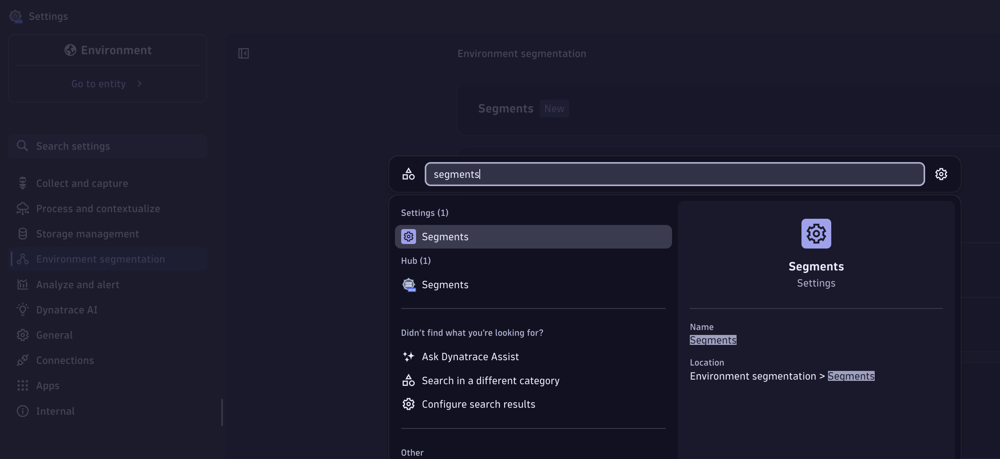

2. Create a new Segment, name it `app`, and enter a variable

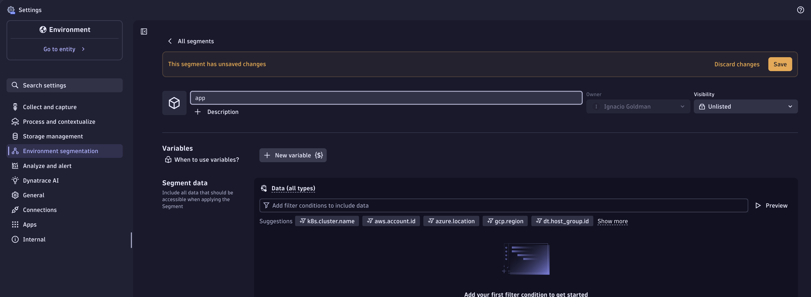

Management Zones used to be each a single configuration object. E.g. there was an `Easytrade` management zone with their respective rules, and many others for others apps, environments & bu. Segments is a `key:value` configuration types, then we have the define the key (that is the name), and the values that are going to be the variables.

3. Add the following as the variable definition, click on run to test, and save the changes

```sql
fetch spans
| dedup dt.entity.host, dt.entity.process_group_instance, dt.smartscape.service

// extract primary grail fileds & tags defined
| fields dt.host_group.id, dt.security_context, dt.cost.costcenter, dt.cost.product,
         dt.entity.host, dt.entity.process_group_instance, dt.smartscape.service, span.id

// filter for classic entities
| fieldsAdd tags = concat("application:", dt.security_context)
| summarize count = count(), by:{dt.security_context, tags}
```

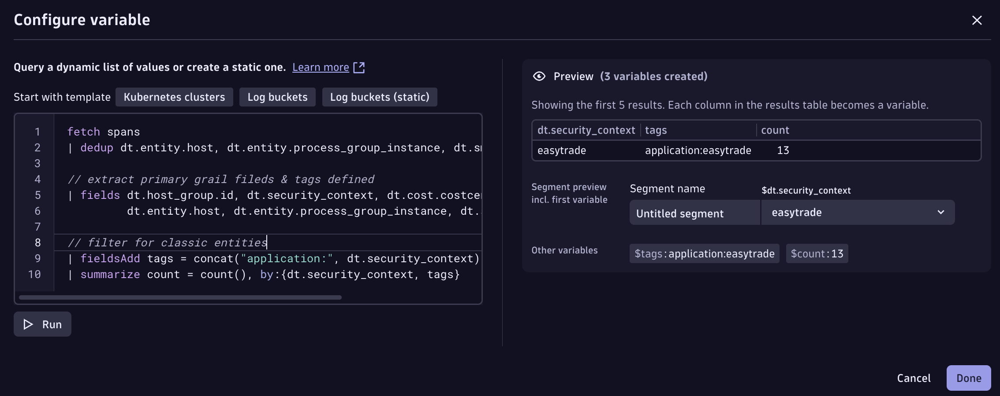

4. Filter `All Data` with the Primary Grail Field, in our case, the dt.security_context, value where we're extracting the app name. Then click in Preview.

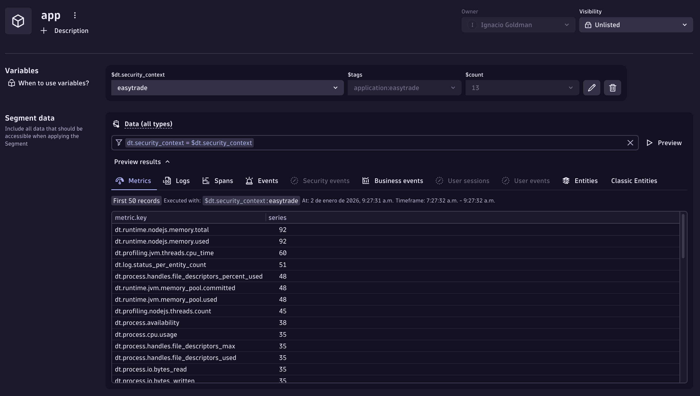

See how all datapoints are getting enriched with the previously configured Primary Grail Field. And also notice how dt.security_context doesn't work for `Classic Entities`. This is meant to be like this, since it is a pure 3rd Gen configuration, and applies just to the "New" entities. And this is the reason why we've created the 2nd variable

```sql
| fieldsAdd tags = concat("application:", dt.security_context)
```

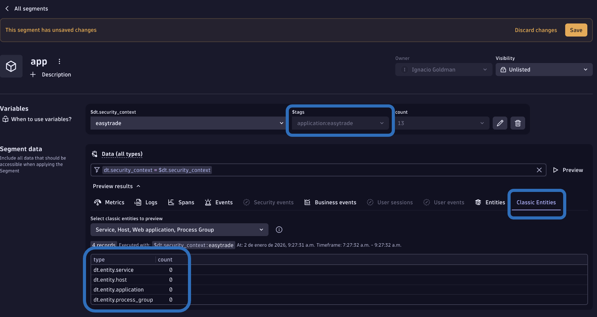

5. Click in More, and add Host

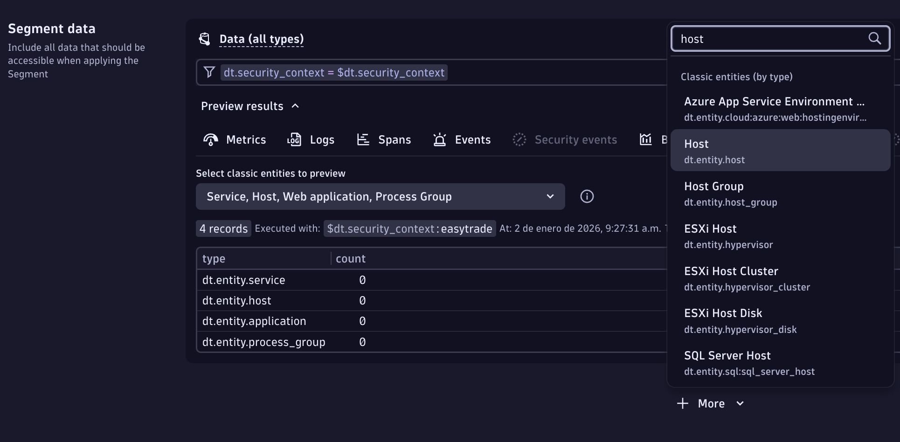

6. Filter by tags, use the "tag" variable value, and preview the results

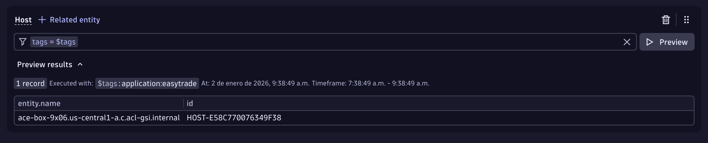

7. Click in related entity, add process group

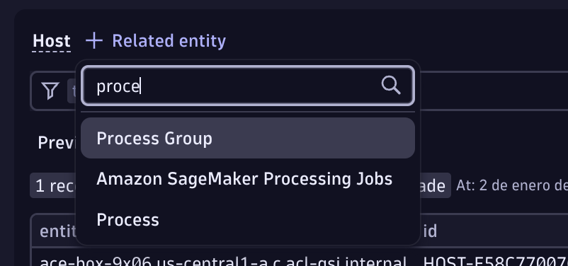

8. Do the same for process & service

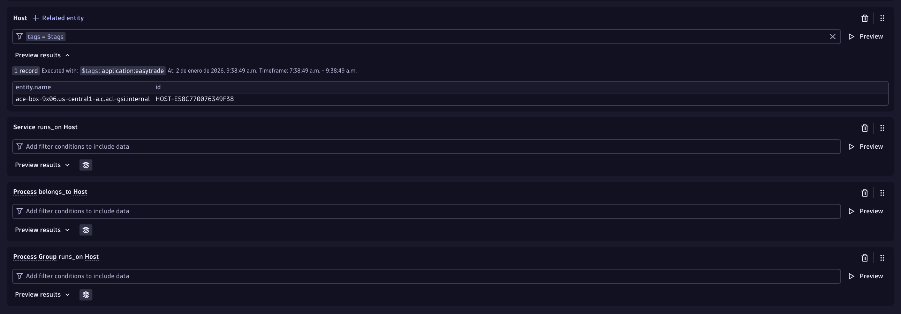

9. Click on preview to check if it works

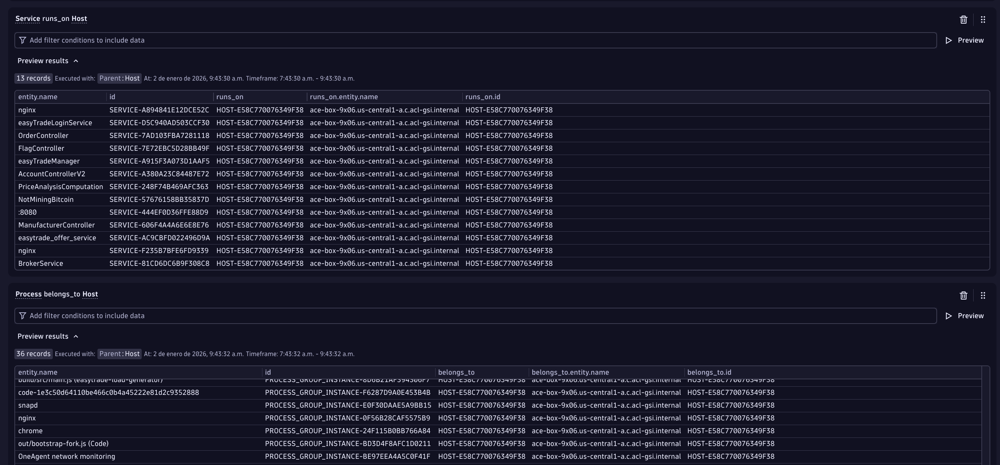

10. Save your Segment!

11. Go to the New Services app, and check if the Segment is working as expected

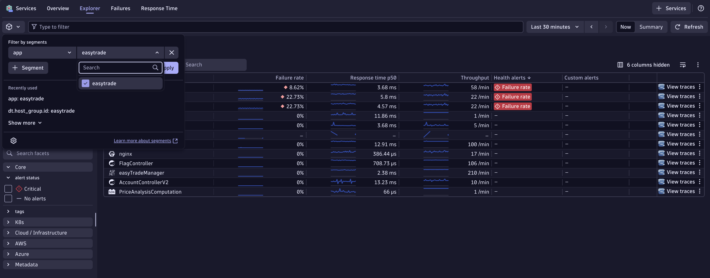

12. Apply and see how all our entities remain when filtering. We just met on of the team's requirements! About filtering across different screens

13. Go to the Distributed Traces app, and filter using the Segment

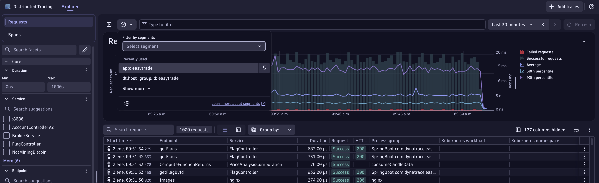

### Close Up

Well done, you just replicated Management Zones functionality using Segments. Now users still achieve their exploration as they were doing it in classic, but unleash powerful new capabilities thanks to Grail and other 3rd Gen capabilities

As an example, you can now filter by any attribute of the spans (e.g. exception message), and pin it to a Dashboard, or to a Notebook to have a ready-made DQL to use in a workflow automation

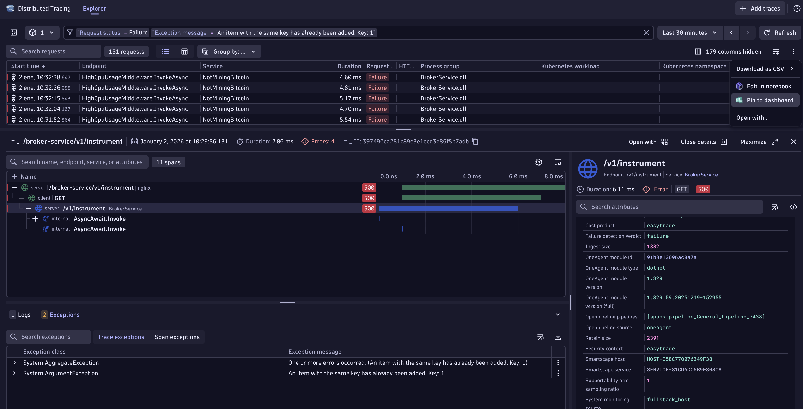


For those teams that are comfortable with using the 3rd Gen apps, you could "close" the access to the classic views, with boundaries at IAM level.

Let's suppose the Easytrade team is happy with the new platform, then you could configure their group at IAM level, using boundaries to exclude the classic distributed traces app as follows


Check boundaries here

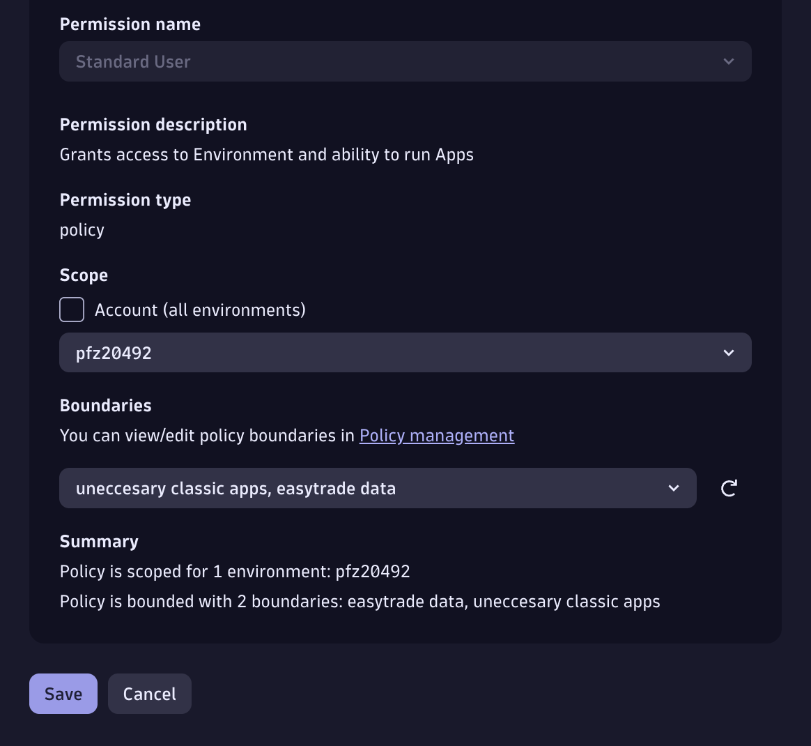

This is how you exclude an app

```sql
shared:app-id not in ("dynatrace.classic.distributed.traces");
```

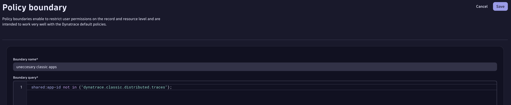

Then the easytrade team will not be able to access the "classic" Distributed traces app, but the new & enhanced experience!

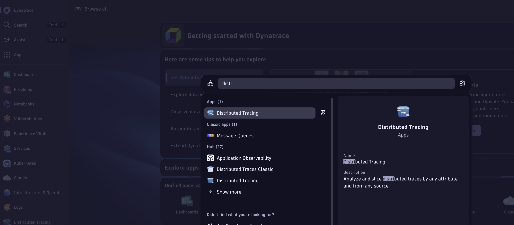