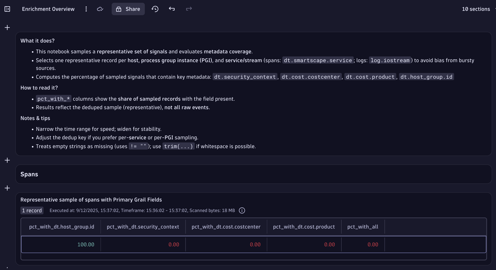
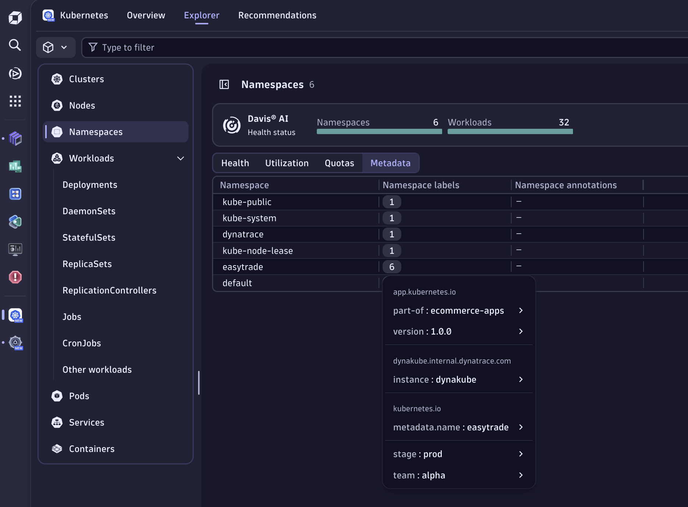
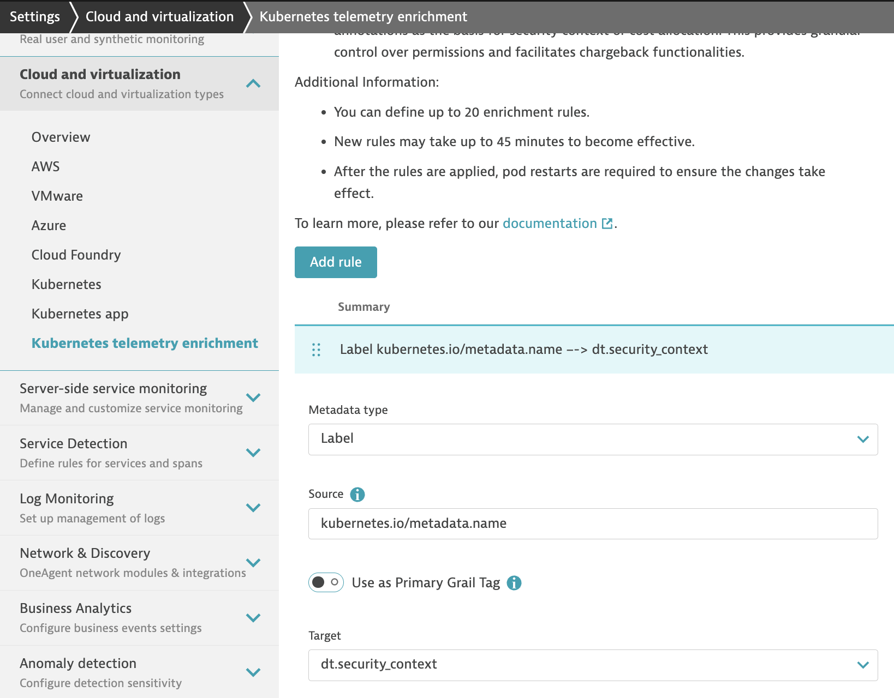
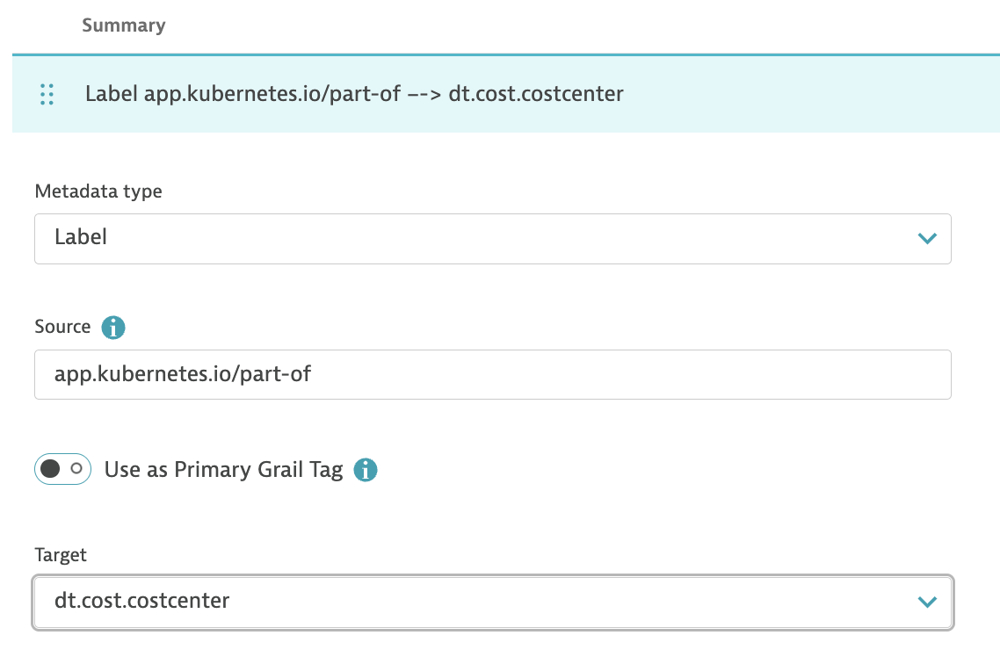
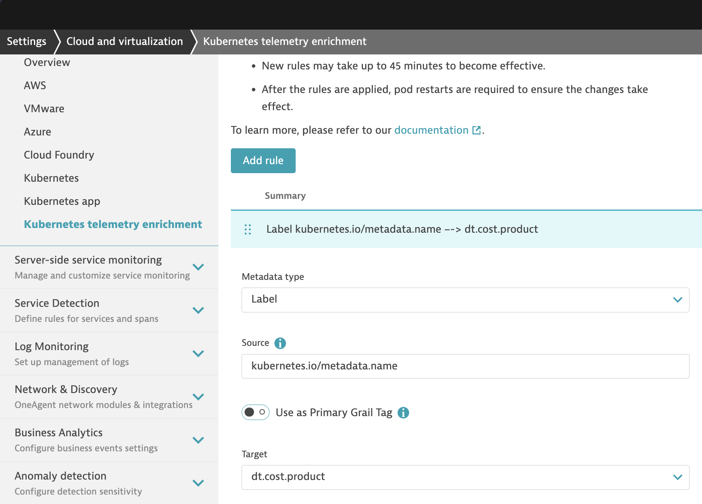
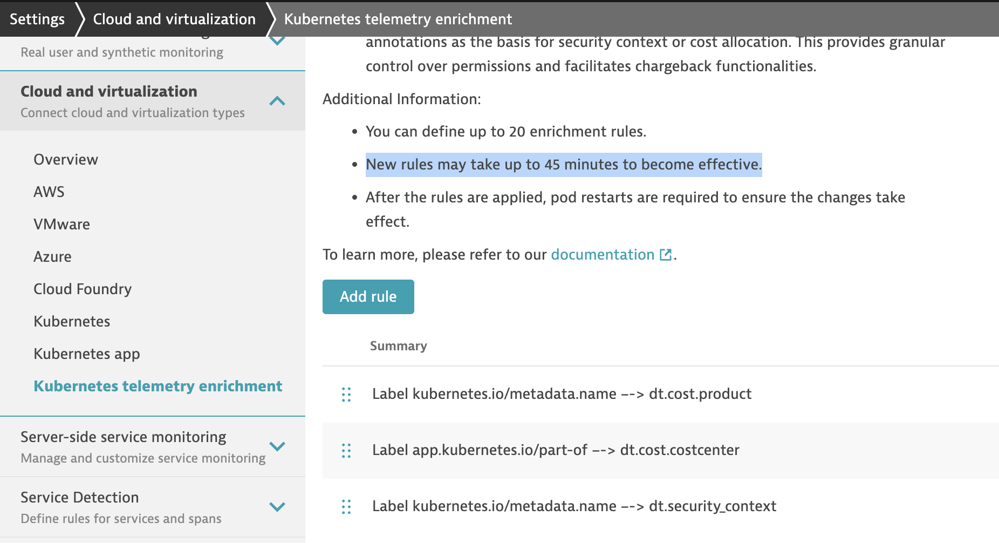
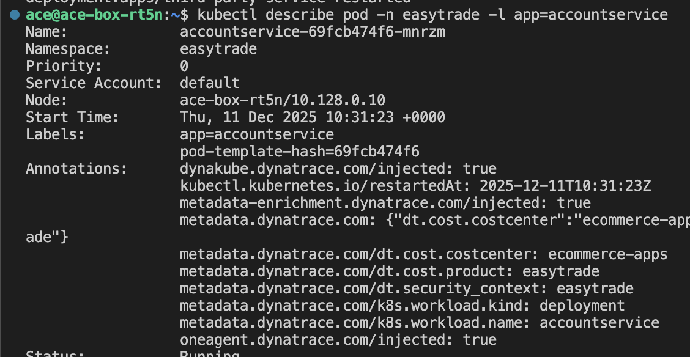
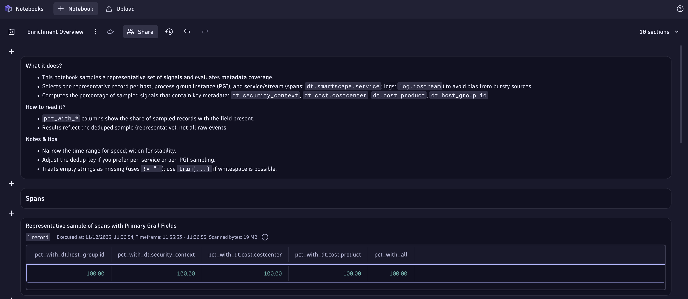
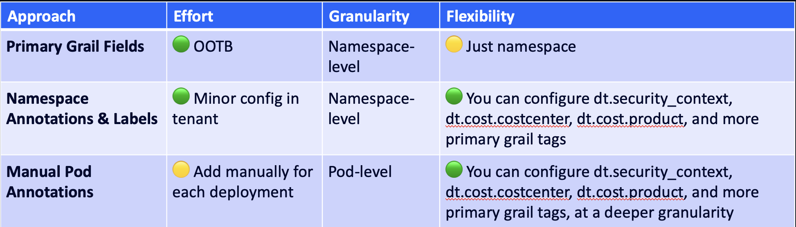

## Metadata Enrichment - Labels & Annotations

We now understand the need for setting the following:
- `dt.security_context`
- `dt.cost.costcenter`
- `dt.cost.product`

1. In your Dynatrace environment, open the **Notebooks app** and click on the provided Notebook `Enrichment Overview`. We will be using this notebook to track the enrichment status within our environment.



Existing customers may face the following scenario: having a host group id, but not dt.security_context, dt.cost.costcenter, or dt.cost.product. 

2. Open the Kubernetes app, go to Namespaces, click on the Metadata tab, and review the existing labels and annotations for the **easytrade** namespace by clicking on the number. You will notice annotations are present but there are no labels.

<div align="center">

</div>

3. In **Settings -> Cloud and virtualization -> Kubernetes telemetry enrichment** configure `dt.security_context` based on the `kubernetes.io/metadata.name` label by clicking Add rule

<div align="center">

</div>

4. Click Add rule and configure `dt.cost.costcenter` based on the `app.kubernetes.io/part-of` label

<div align="center">

</div>

5. Click Add rule and configure `dt.cost.product` based on the `kubernetes.io/metadata.name` label

<div align="center">

</div>

6. Click **Save changes**

7. The following step is not necessary in a real-life scenario: The Dynatrace Operator queries the settings API once every 45 minutes. After creating or modifying rules, if you want to ensure immediate effect, you can restart it. To restart the operator to grab latest configuration changes:

```bash
kubectl -n dynatrace rollout restart deployment dynatrace-operator
```




8. Restart all deployments in the easytrade namespace:

```bash
for d in $(kubectl -n easytrade get deploy -o name); do
  kubectl -n easytrade rollout restart "$d"
done
```

9. Validate that the command worked after a few minutes and make sure the enrichment is there under the labels section we checked in the Kubernetes App (if it's not, please run the command above again).

```bash
kubectl describe pod -n easytrade -l app=accountservice
```



10. Review your **Enrichment** Notebook with the updated values



## Close Up & Next Challenge

Well Done! We have now enriched our Dynatrace Platform environment based on how we want to slice and dice our data.

Now, we will run into a new challenge:,
Easytrade doesn’t follow kubernetes standards and has multiple teams working within the same namespace. We need to provide data access; not at the application level (easytrade), but at the component level (e.g. BrokerService). We need lower granularity!

We will solve this by performing pod annotations in our next lab.



Good job! Now, back to the slides.
