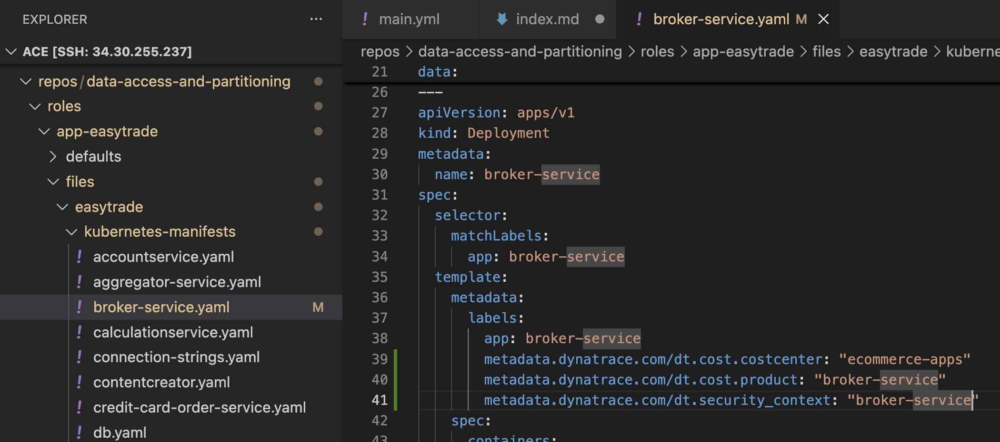

## Metadata Enrichment - Manual Pod Annotations

### New Challenge

Easytrade doesn’t follow k8s standards, and have multiple teams working within the same namespace

We need to provide data access, not at app level (easytrade), but at component level (e.g. BrokerService)

We need a higher level of granularity

### Exercises

1. Modify pod definition for BrokerService, adding it owns dt.security context, cost cvwente & product



2. Apply changes

kubectl apply -k "/home/$USER/repos/data-access-and-partitioning/roles/app-easytrade/files/kustomize/base" -n easytrade

2. Validate it has it owns, in pod and in Dynatrace

```bash
kubectl describe pod -n easytrade -l app=broker-service
```

3. Run command to redeploy all pods with the custom values

kubectl apply -k roles/app-easytrade/files/kustomize/overlays/with-annotations -n easytrade

4. Check another workload

```bash
kubectl describe pod -n easytrade -l app=frontend
```


5. Check the Enrichment Notebook one more time


Well Done, you manage to achieve a custom higher level of granularity.

Discuss with your class how to enrich a regular OA & Cloud!

That was easy, what's next? Back to slides


