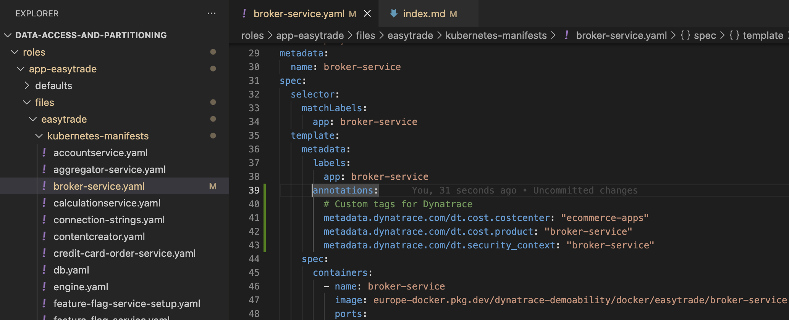
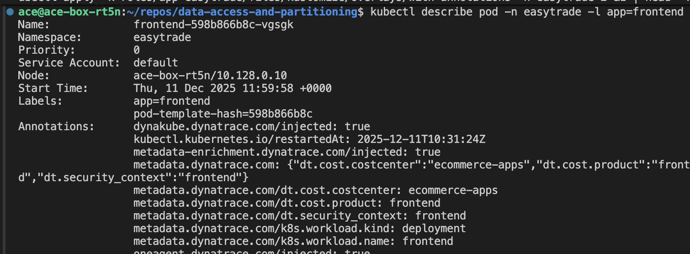
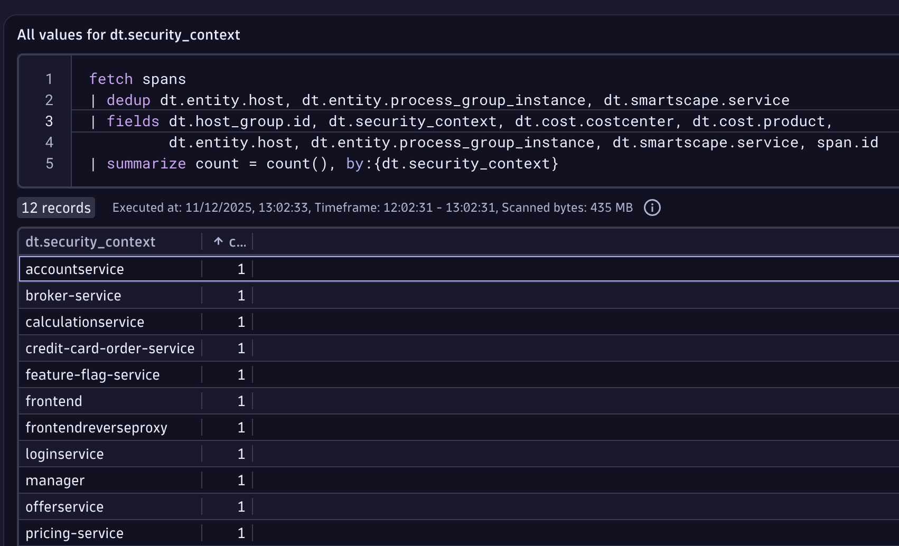

## Metadata Enrichment - Manual Pod Annotations

### New Challenge

Easytrade application has multiple teams working within the same namespace. We need to provide data access, not at the application level (easytrade), but at the component level (e.g. BrokerService). We need a finer level of granularity!

### Exercises

1. Within the VM, edit the `broker-service` resource, Easier if you're using an IDE, otherwise access the file edition with vi:

```bash
vi /home/$USER/repos/data-access-and-partitioning/roles/app-easytrade/files/easytrade/kubernetes-manifests/broker-service.yaml
```

2. Modify pod definition for BrokerService, adding its own `dt.security_context`, `dt.cost.costcenter` & `dt.cost.product`.



Need help? If you are having issues with the editor, you can just run this command. It will automatically enrich broker-service with its own dynatrace fields as the screenshot above!

```bash
kubectl apply -k /home/$USER/repos/data-access-and-partitioning/roles/app-easytrade/files/broker-service-dt-annotations.yaml
```

3. Validate that the command worked after a few minutes and make sure the enrichment is there under the `Annotations` section (if it's not, please run the command above again).

```bash
kubectl describe pod -n easytrade -l app=broker-service
```

4. Validate within the Enrichment Overview Notebook, is broker-service dt.security_context being populated in Dynatrace?

5. Now run the command to re-deploy all pods with the new custom values (not just for broker-service).

```bash
kubectl apply -k "/home/$USER/repos/data-access-and-partitioning/roles/app-easytrade/files/kustomize/overlays/with-annotations" -n easytrade
```

> Note: this command is applying a kustomize patch where all resources gets added the dynatrace annotations automatically. Feel free to explore the file, the idea behind it was to avoid making you change the resources one by one

6. Validate that the command worked after a few minutes and make sure the enrichment is there under the labels section of another workload such as `frontend` (if it's not, please run the command above again).

```bash
kubectl describe pod -n easytrade -l app=frontend
```



7. Review the **Enrichment** Notebook and click "Run" under the section labeled `All values for dt.security_context`



Well done! You were successful in achieving a finer level of granularity.

Discuss with your class how to enrich a regular OneAgent deployment as well as a Cloud one!

That was easy. What's next? Back to the slides.

