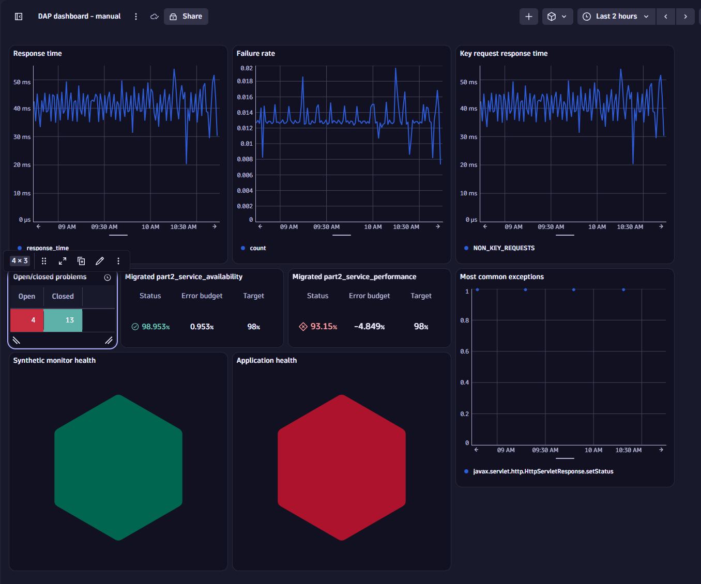
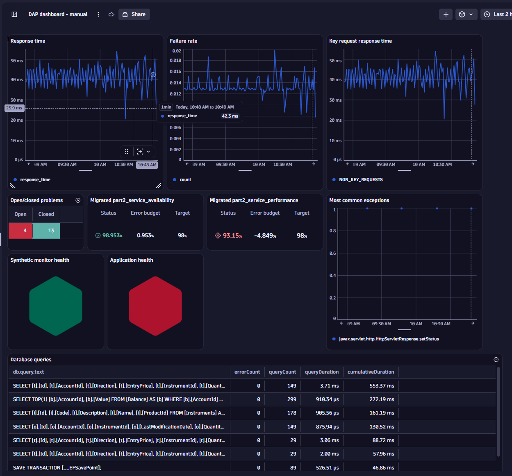

## Dashboard Upgrade

The Eastrade team has been using their own classic dashboard for years, and they want to cover the same requirements for 3rd Gen.

1. Go to classic dashboards and open the easytrade dashboard, check how the dashboard has a predefined Management Zone filter 


SCREENSHOT OF DASHBOARD WITH THE FOLLOWING TILES: 
    - RESPONSE TIME OF ALL EASYTRADE SERVICES
    - FAILURE RATE OF ALL EASYTRADE SERVICES
    - FAILURE RATE OF SPECIFIC REQUEST (KEY REQUEST)
    - MDA OF MOST COMMON EXCEPTION
    - RUM TILE
    - PROBLEMS TILE
    - SLO TILE
    - SYNTHETIC TILE

2. Click on auto upgrade

SCREENSHOT


3. As Management Zones & Segments are defined differently, we need to re-create the filters in 3rd Gen with the previous created Segments

SCREENSHOT

4. Manually upgrade what is missing

DQL for problems tile
```
fetch dt.davis.problems
| summarize Open = countIf(event.status != "CLOSED"), Closed = countIf(event.status == "CLOSED")
```

Step by step instructions for SLOs (optional hands on)
- Go to classic SLOs and open the metric in metric explorer
- in metric explorer open the advanced expression in notebooks
- in the DQL statement, replace in the last line the field `expression` with sli
- copy the DQL statement and open the SLO app
- in the SLO app add a new custom SLO
- pin the SLO to dashboard



5. Improve dashboard with tiles & views that were not possible before. E.g. Exceptions? Logs? Business events?​

SCREENSHOT
Pin top database queries on dashboard from services


Once validated and approved, we will demonstrate how classic apps can be disabled, to simplify the navigation for end users, and avoid for them to be using the old screens.
