## Dashboard Upgrade

The Eastrade team has been using their own classic dashboard for years, and they want to make sure to have it for 3rd Gen. They are also curious on how they can improve their dashboards with all the new functionalities.

Dynatrace allows you to track the classic dashboards popularity. This is a great feature when moving into 3rd Gen, to reduce the scope, and focus the upgrade in what matters. The Easytrade team has received a notification from the Dynatrace Admins in the organization, that the EasyTrade dashboard needs an upgrade. The teams agree with the statement, since it is the most used dashboard, and they proceed with the instructions.

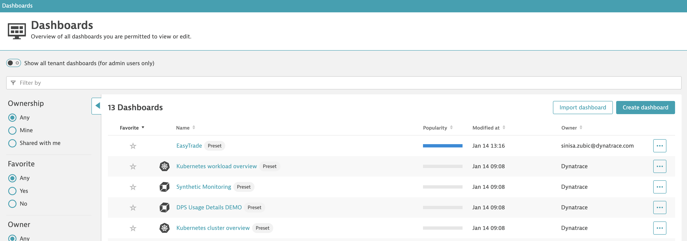

### Automated!

1. Go to classic dashboards and open the easytrade dashboard, check how the dashboard has a predefined Management Zone filter 

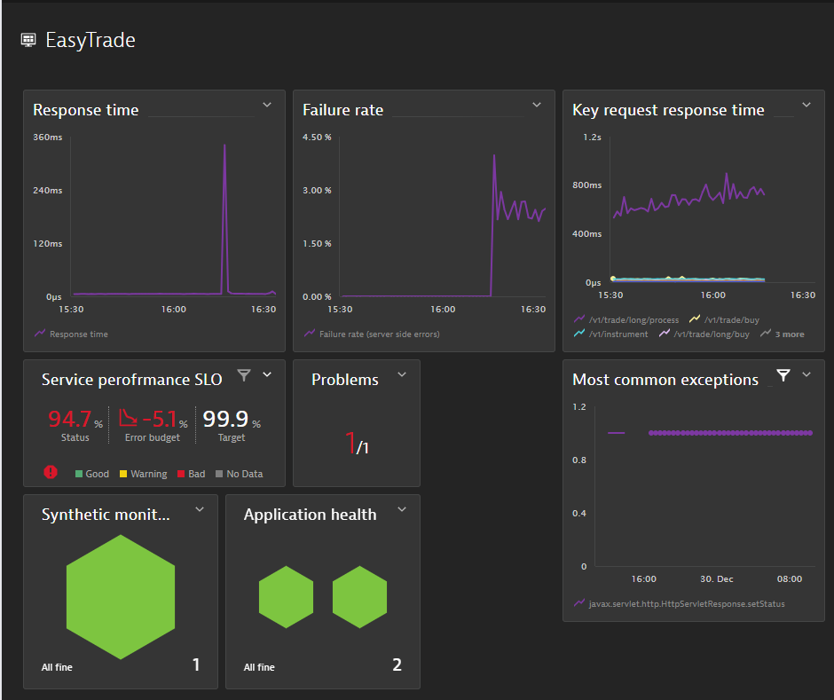

2. Click on the 3-dots, then Upgrade. Notice that the existing classic dashboard will remain the same, it is not lost during the upgrade

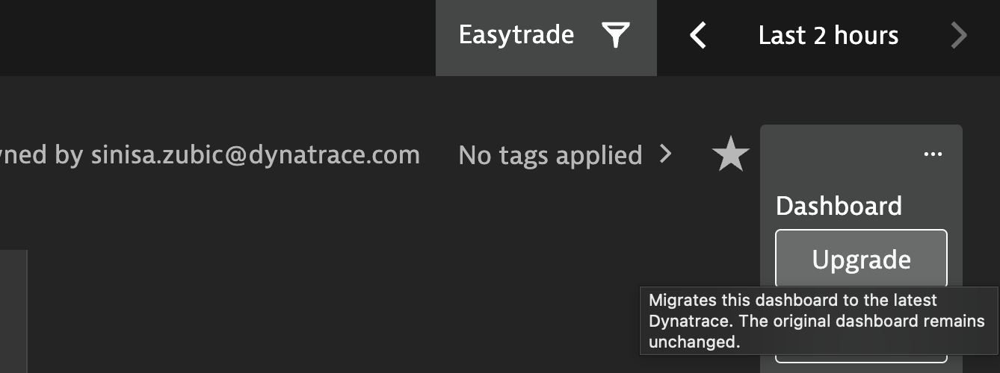

3. The previous dashboard was filtering by Management Zone. The new dashboard then needs to filter by Segment. As we already have a solid Segment definition, our dashboard should work as well

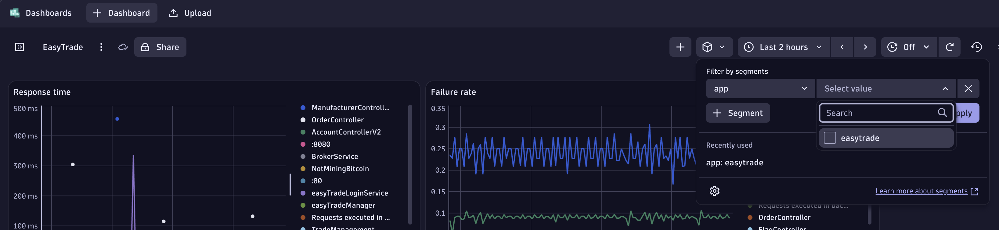

### Manual leftovers

Some tiles are not automatically upgraded, [check official doc](https://docs.dynatrace.com/docs/analyze-explore-automate/dashboards-classic/dashboards-upgrade-classic-to-latest#in-scope-not-yet). 

4. Create a new DQL tile

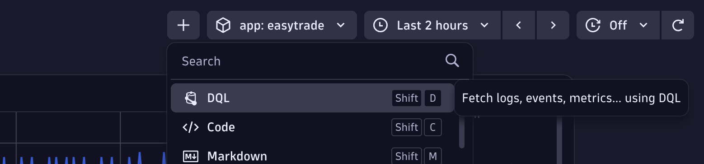

5. Use this DQL code, and click run

```
fetch dt.davis.problems
| filter dt.davis.is_duplicate == false
| fields display_id, event.status
| summarize {Open = countIf(event.status != "CLOSED"), Closed = countIf(event.status == "CLOSED")}, by:{display_id}
```

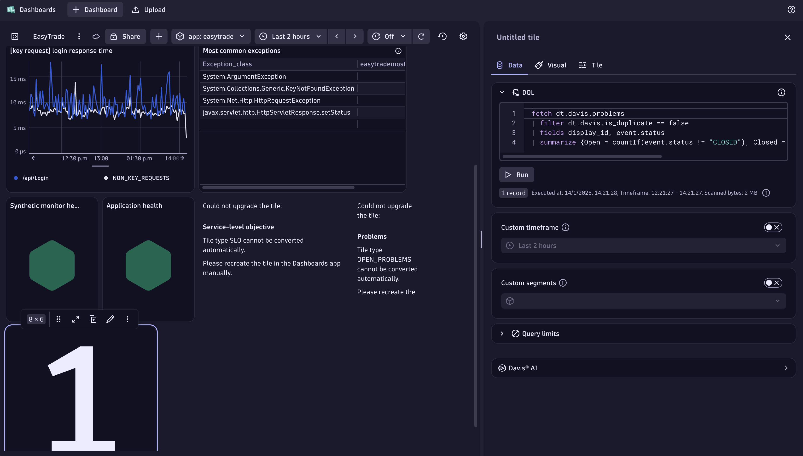

6. Delete the placeholder for problems, and add the just created DQL in the respective section

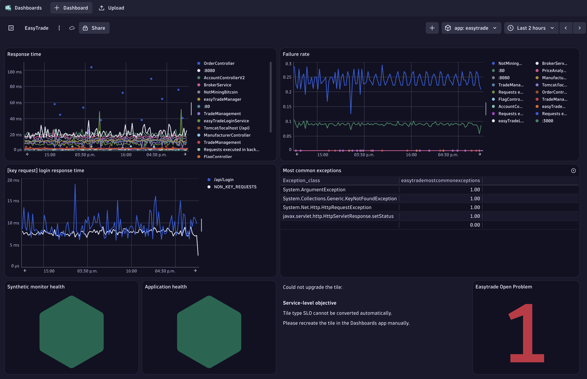

#### Upgrade SLO

7. Go to the `classic Service-level objectives app`, and open the metric in metric explorer

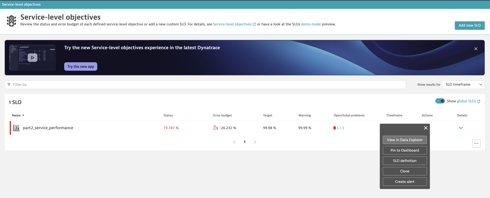

8. Click on `Open with...`, and add it to a Notebook

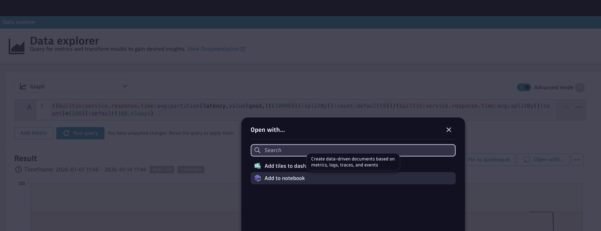

9. Replace in the last line the field `expression` with `sli`, and copy the entire command

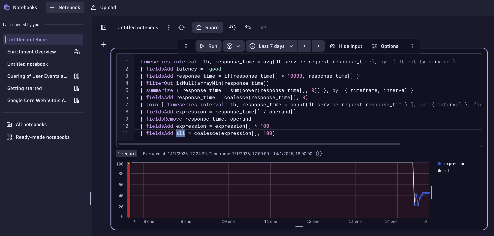

10. Go to the new SLO app, click on `+ Service-level objective`, and `+ Custom SLO`

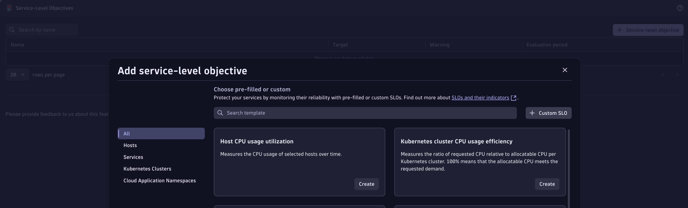

11. Paste the expression, then click in refresh, and save the SLO

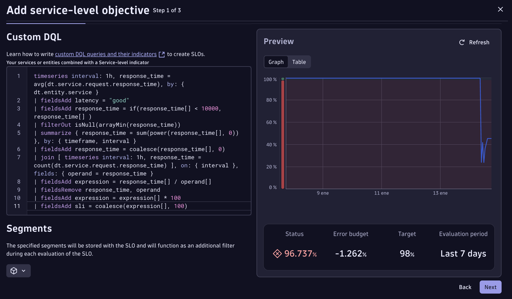

12. Finish configuring the SLO, and Pin it to your dashboard

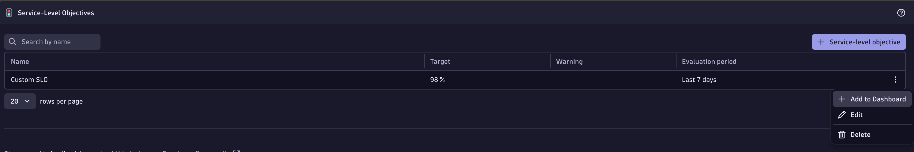

Well done, you should have upgraded your dashboard to 3rd Gen

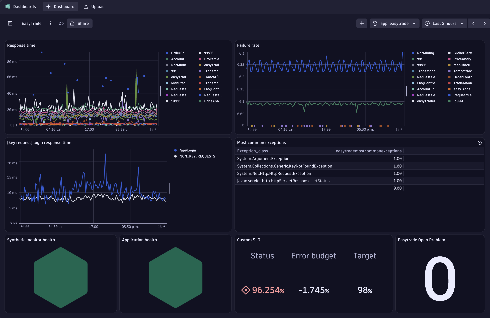

#### Unleash the Power!

Let's discover how easy we can get huge value from 3rd Gen, by improving the dashboard with tiles & views that were not possible before (or limited).

13. Click on +, add top db statements

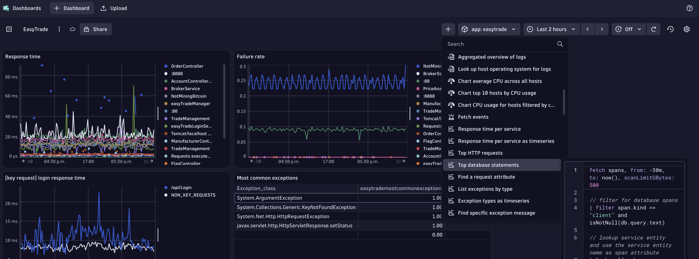

14. Add tiles for logs with error, and the bizevents with the information of Easytrade's user deposits

fetch logs
| filter status == "ERROR"
| makeTimeseries count(), interval: 1m

fetch logs
| filter status == "ERROR"
| fields content, timestamp

fetch bizevents
| filter event.type == "com.easytrade.deposit"
| fields name, balance, amount, event.type

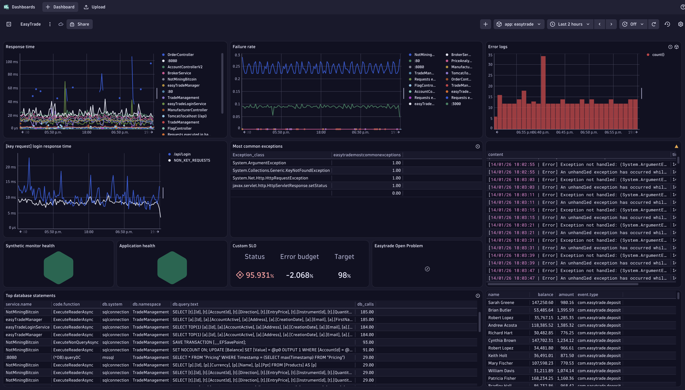