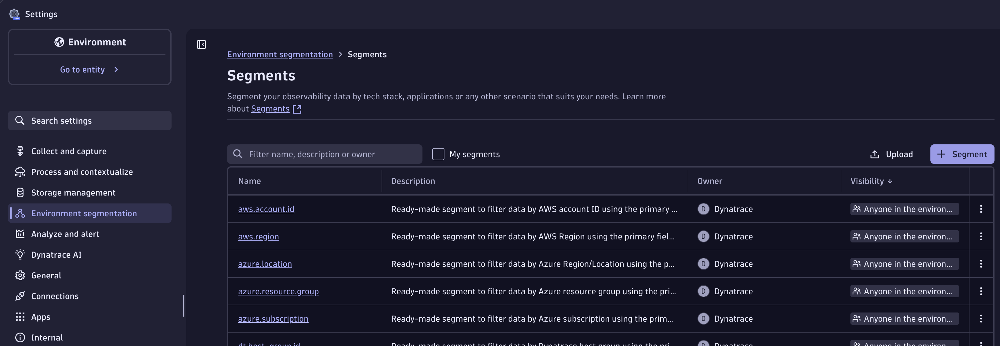
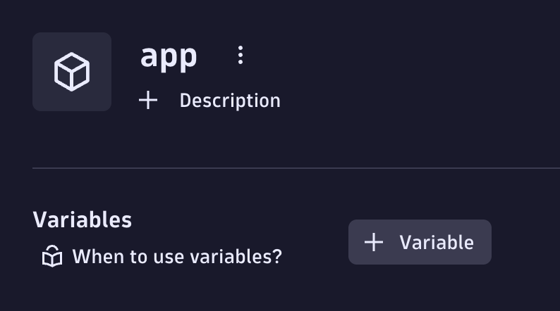
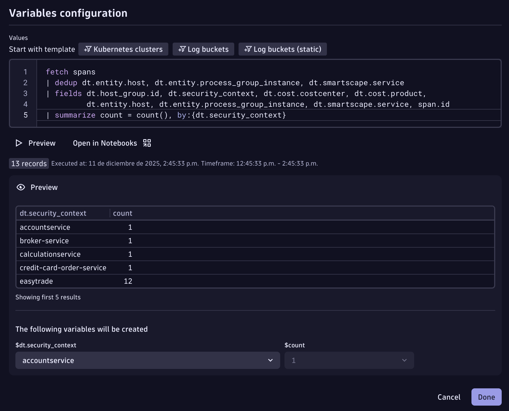
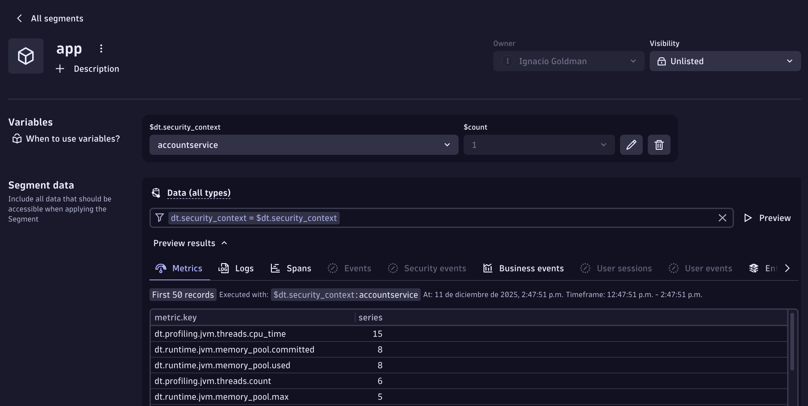
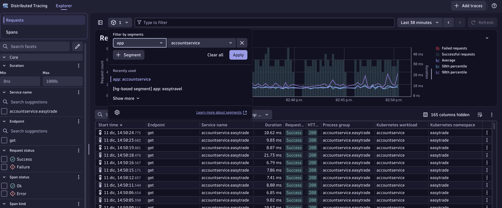
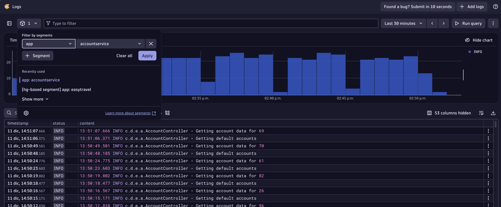

## Data Segmentation

With data access already sorted out, let's create **Segments** to filter our data across different Dynatrace views based on each team's component

1. Go to the `Settings` application, click on `Environment segmentation`, click on `Segments` and click on the **"+ Segment"** button.



2. Name it **"app"**, and create a variable by clicking on **"+ Variable"**.

<div align="center">

</div>

3. Copy and paste the following code, click on preview, and save it by pressing done.

```sql
fetch spans
| dedup dt.entity.host, dt.entity.process_group_instance, dt.smartscape.service
| fields dt.host_group.id, dt.security_context, dt.cost.costcenter, dt.cost.product,
         dt.entity.host, dt.entity.process_group_instance, dt.smartscape.service, span.id
| summarize count = count(), by:{dt.security_context}
| fieldsRemove count
```




4. Now, let's make sure we provide a filter which this Segment will be based on. **"Data (all types)"** is already pre-selected for you. All you need to do is add the filter:

Please add - `dt.security_context = $dt.security_context` and press `Save` in the top right.



> Note: K8s events are not enriched yet, but you can use the host group defined in the dynakube.

5. Validate the Segment is working by going to the `Distributed Tracing` and `Logs` applications and applying the segment using the cube icon near the filter bar as shown below:





Good job! Back to the slides for some theory.
