## Alerting

### Why Are We Moving Away from Classic Alerting?
Dynatrace Classic alerting relied on:
- **Problem Notifications**: Defined where notifications were sent (channels, integrations).
- **Alerting Profiles**: Defined what problems triggered notifications using reusable filters.

#### How Dynatrace Platform Alerting Improves on Classic Alerting: 
- **Classic Alerting**
    - **Rigid integrations**: Hardcoded, lacked flexibility.
    - **Only for problems**: Couldn’t trigger on specific events.
    - **Limited context in notifications**: Messages lacked detailed insights that Dynatrace Platform alerting offers now.
    - **No execution transparency**: No way to inspect delivery status or debug failures.

- **Dynatrace Platform**
    - **Flexible, Event-Driven Triggers** - Alert on any event stored in Grail—not just problems. Includes Davis events, custom events, and metric anomalies.
    - **Workflows for Intelligent Automation** - Replace rigid notifications with customizable workflows that define how, when, and where actions occur—trigger remediation scripts, create tickets, or send alerts.
    - **Execution Transparency** - Full visibility into workflow runs with logs, status, and outcomes for simplified troubleshooting and validation.
    - **User-Level Ownership** - Configure workflows without impacting others. Each user/team can manage their own automation safely.
    - **Automation-Ready Architecture** - Designed for proactive, event-driven responses—move beyond notifications to intelligent remediation and governance.

### Why Davis Anomaly Detection?
Dynatrace Gen3 introduces Davis Anomaly Detection powered by Grail:
- **Advanced flexibility with DQL**: Define anomaly conditions using powerful queries that combine multiple metrics, dimensions, and filters. This enables richer context and smarter alerting compared to static metric events in Classic.
- **Cross-domain correlation**: Detect anomalies across logs, metrics, and traces in a single detector, leveraging Grail’s unified data model—something Classic alerting could not achieve.
- **Event-driven automation**: Seamlessly integrate with Workflows for intelligent responses, moving beyond static notifications.
- **Transparency and control**: Full visibility into execution logs, outcomes, and workflow runs for simplified troubleshooting.

### Why Workflows?
Dynatrace Workflows alerting moves beyond static notifications and introduces **dynamic, customizable automation**. Instead of simply sending alerts, you can define exactly **how, when, and where** actions should occur. Workflows allow you to **trigger notifications, execute remediation scripts, create tickets, and more**, all based on any event stored in Grail, including problems, Davis events, or generic events. With full **execution transparency**, you can easily view logs, monitor status, and validate outcomes, making troubleshooting and automation simpler and more **reliable**.

### Lab Objectives
By the end of this lab, you will:
1. Transform an existing metric event into a Davis anomaly detector.
2. Validate the anomaly detection configuration.
3. Create a workflow that reacts to a dt.davis.problem event and sends an email notification.

### Hands-On Steps

#### Step 1: Review Existing Metric Event

- Navigate to Settings → Anomaly Detection → Metric Events.
- Locate the pre-existing metric event → "Test Alert - Metric Selector - Static Threshold" .

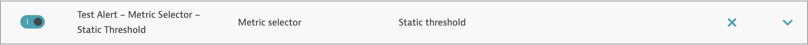

#### Step 2: Transform Metric Event to Davis Anomaly Detector

- Go to Anomaly Detection → Davis Anomaly Detection. 
- Click + New Alert.

- Choose "Improve metric events with DQL".
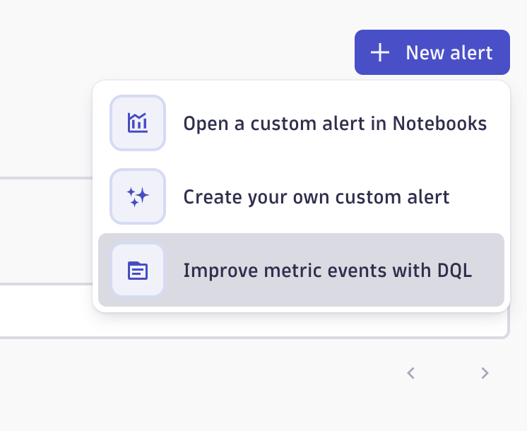
- Select the existing metric event "Test Alert - Metric Selector - Static Threshold" and click "Transform".
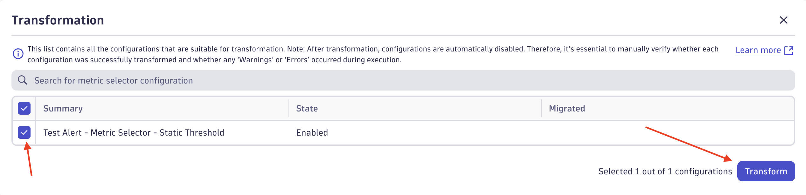
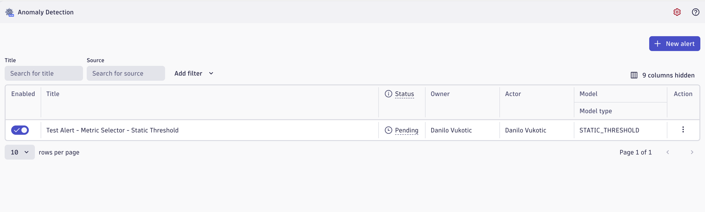
- Review the transformation screen showing metric event → anomaly detector - DQL editor with generated query.
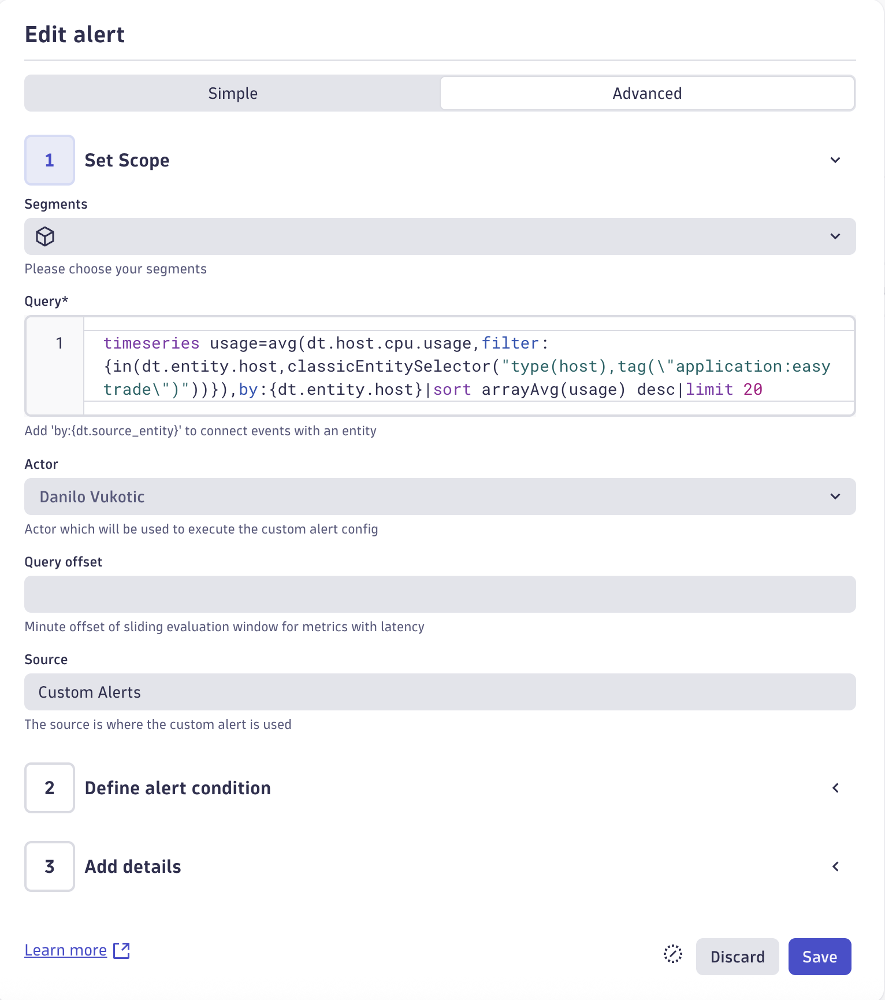
- Review the generated DQL query and adjust if needed.

#### Step 3: Validate Anomaly Detection

- Trigger a test scenario or wait for real data.
- Confirm that Davis detects anomalies as expected.
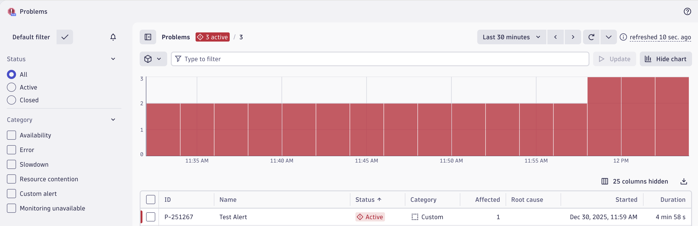
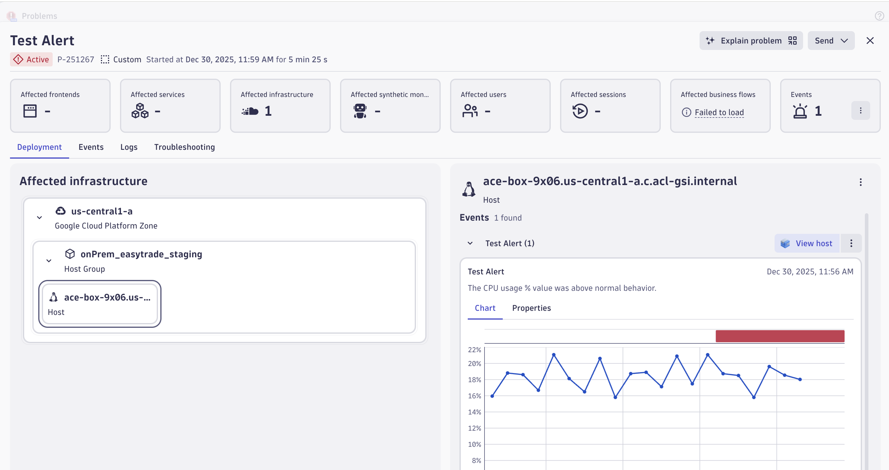

#### Step 4: Create a Workflow for Email Notification

- Navigate to Workflows → + Create Workflow.
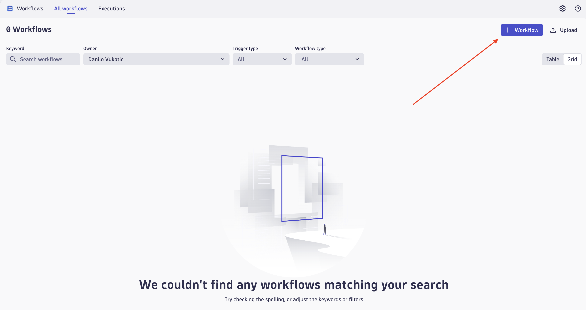
- Name your workflow "Test Workflow"
- Select Trigger: Davis Problem Event (dt.davis.problem).
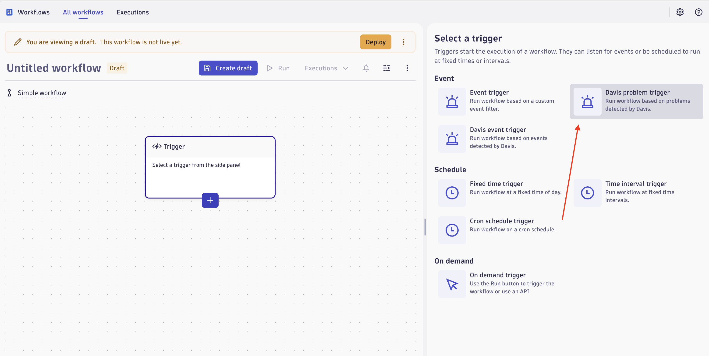
- Add the config:
    - Event state: Active
    - Event category: Custom
    - Affected entities: Include entities with all defined tags below
        - Entity tags: application: easytrade
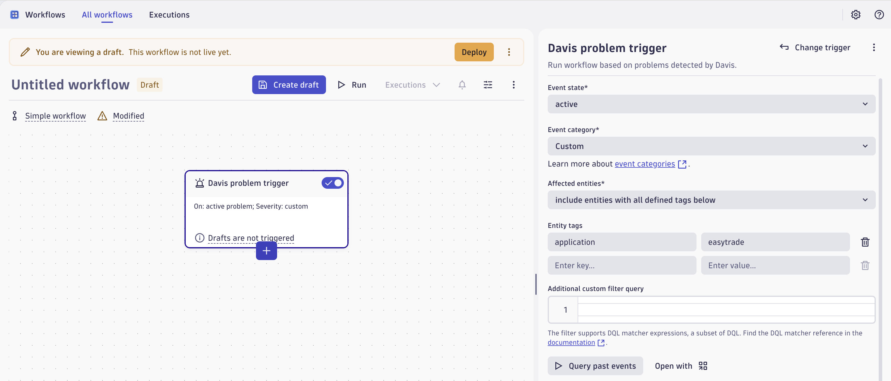
- Add an Action: Send Email.
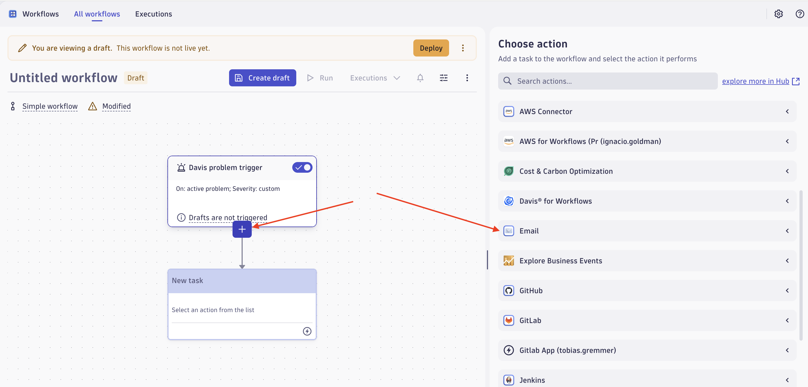
- Configure your email action the way you like it and click "Deploy" then "Save and Deploy".
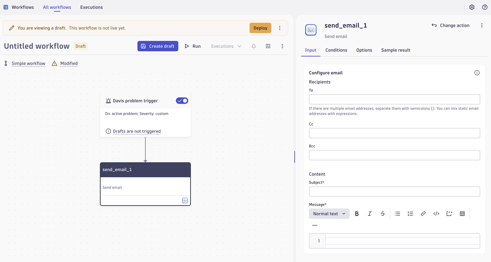

#### Step 5: Test the Workflow

- Check the Problems App and the alert we've already generated.
- Run the workflow, click on "Allow & Run" and verify that the email notification is successfully sent to your email address.

Key takeaway: Alerting in Gen3 is not just about notifications—it’s about intelligent, event-driven automation that adapts to your environment.

We hope you thoroughly enjoyed all of our labs! 

Time for Q&A!