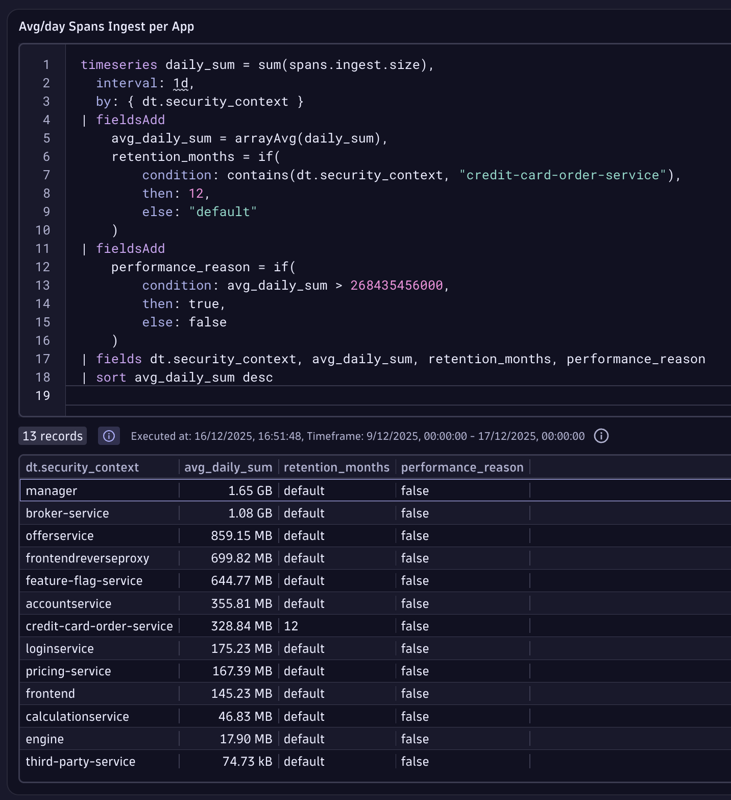

## Data Partitioning

So far we have enrichement in place, data access & segmentation all sorted out. Now let's focus on the query performance & costs, for that we will implement a Bucket Strategy.

1. Go to the Notebook app, and open the `Data Partitioning Helper`. Run the `Spans Tb/day` & `Logs Tb/day` tiles and check the avg volume a day for both

✅ Both ingest size are lower than 5Tb/day, meaning that 80 buckets will meet our requirements. 

2. We need to now calculate the spans traffic per app, check on the query below how every single span has a dt.ingest.size attribute

3. We will use this attribute to create a metric in Openpipeline, with the dt.security_context as dimensions. Go to the Spans OpenPipeline

4. Click on the Pipelines tab and then create a new one with + Pipeline

5. Create a metric extraction rule that grabs the dt.ingest.size field, and has the dt.security_context as dimension

6. Go to the Dynamic Routing and create a new one with + Dynamic Route

7. Route all the traffic to the respective pipeline

8. Go back to your Notebook and run the DQL of the `Spans Ingest a day per App` tile

9. Run the `Avg/day Spans Ingest per App` tile

### Data Retention & Performance Requirements

Let's suppose Span of credit-card-order-service retained for 12 months for auditing and compliance (PCI DSS). Let's add it to the table, run this DQL

11. Uncomment the query and run it again

12. Another column with bucket naming convention

SCREENSHOT

13. Create bucket 

SCREENSHOT

14. Create rule in OpenPipeline to route traffic

SCREENSHOT

15. Validate 

SCREENSHOT