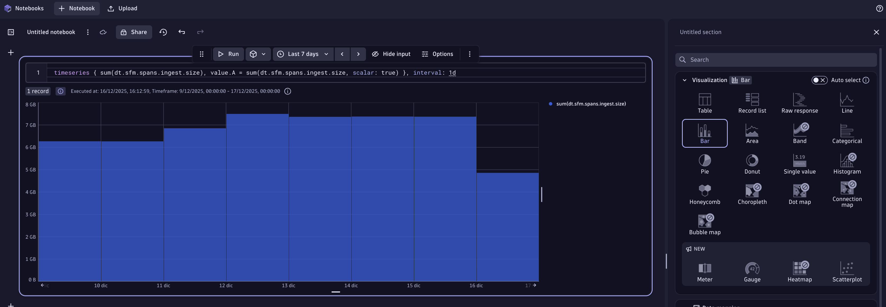
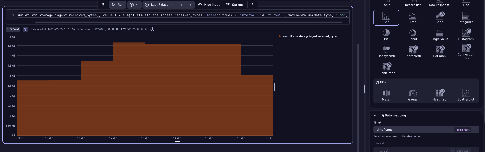
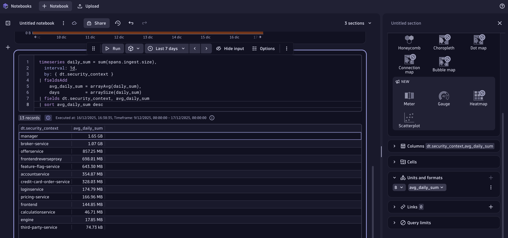
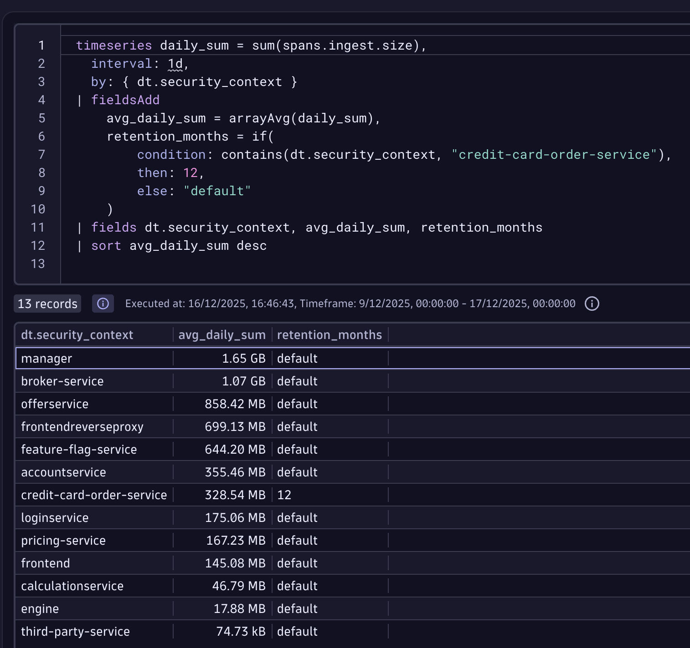

## Data Partitioning

So far we have enrichement in place, data access & segmentation all sorted out. Now let's focus on the query performance & costs, for that we will implement a Bucket Strategy.

1. Open the Notebook app, and add the following DQL, make it visible as a bar chart for the last 24hs at least

timeseries { sum(dt.sfm.spans.ingest.size), value.A = sum(dt.sfm.spans.ingest.size, scalar: true) }, interval: 1d

2. Now for logs

timeseries { sum(dt.sfm.storage.ingest.received_bytes), value.A = sum(dt.sfm.storage.ingest.received_bytes, scalar: true) }, interval: 1d, filter: { matchesValue(data.type, "Log") }

Both ingest size are lower than 5Tb/day, meaning that 80 buckets will meet our requirements

3. We need to now calculate the spans traffic per app, check that every single span has a dt.ingest.size attribute. Run the following DQL in your Notebook and look for the field dt.ingest.size 

fetch spans
| limit 1

We will use this attribute to create a metric in Openpipeline, with the dt.security_context as dimensions.

4. Go to the Spans OpenPipeline

5. Click on the Pipelines tab and then create a new one with + Pipeline

6. Create a metric extraction rule that grabs the dt.ingest.size field, and has the dt.security_context as dimension

7. Go to the Dynamic Routing and create a new one with + Dynamic Route

8. Route all the traffic to the respective pipeline

9. Go back to your Notebook and add a new DQL with the new created metric. You can format the bytes automatically depending the value within the options of the tile

timeseries daily_sum = sum(spans.ingest.size),
  interval: 1d,
  by: { dt.security_context }
| fieldsAdd
    avg_daily_sum = arrayAvg(daily_sum),
    days          = arraySize(daily_sum)
| fields dt.security_context, avg_daily_sum
| sort avg_daily_sum desc

### Data Retention requirements

10. let's suppose Span of credit-card-order-service retained for 12 months for auditing and compliance (PCI DSS). Let's add it to the table, run this DQL

timeseries daily_sum = sum(spans.ingest.size),
  interval: 1d,
  by: { dt.security_context }
| fieldsAdd
    avg_daily_sum = arrayAvg(daily_sum),
    retention_months = if(
        condition: contains(dt.security_context, "credit-card-order-service"),
        then: 12,
        else: "default"
    )
| fields dt.security_context, avg_daily_sum, retention_months
| sort avg_daily_sum desc

11. Improve your query by checking if you need a new bucket due performance reasons

timeseries daily_sum = sum(spans.ingest.size),
  interval: 1d,
  by: { dt.security_context }
| fieldsAdd
    avg_daily_sum = arrayAvg(daily_sum),
    retention_months = if(
        condition: contains(dt.security_context, "credit-card-order-service"),
        then: 12,
        else: "default"
    ),
    performance_reason = if(
        condition: avg_daily_sum > 268435456000,
        then: true,
        else: false
    )
| fields dt.security_context, avg_daily_sum, retention_months, performance_reason
| sort avg_daily_sum desc

12. Another column with bucket naming convention

SCREENSHOT

13. Create bucket 

SCREENSHOT

14. Create rule in OpenPipeline to route traffic

SCREENSHOT

15. Validate 

SCREENSHOT