## Data Partitioning

So far we have enrichement in place, data access & segmentation all sorted out. Now let's focus on the query performance & costs, for that we will implement a Bucket Strategy.

1. Go to the Notebook app, and open the `Data Partitioning Helper`. Run the `Spans Tb/day` & `Logs Tb/day` tiles and check the avg volume a day for both

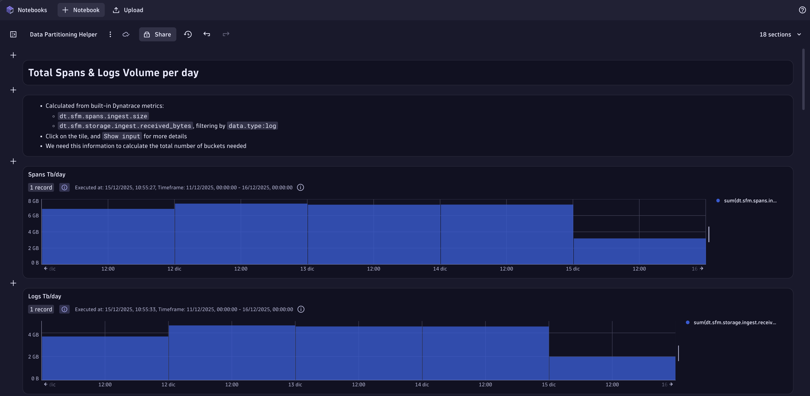

✅ Both ingest size are lower than 5Tb/day, meaning that 80 buckets will meet our requirements. 

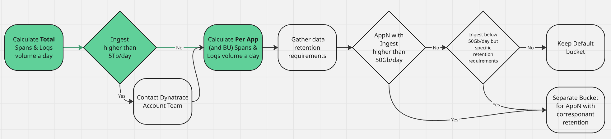

2. We need to now calculate the spans traffic per app, check on the query below how every single span has a dt.ingest.size attribute

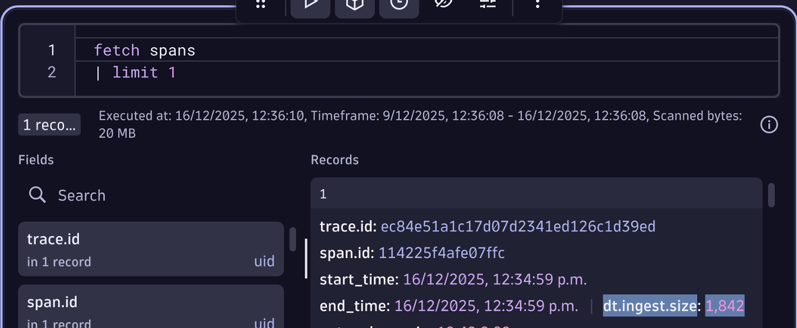

3. We will use this attribute to create a metric in Openpipeline, with the dt.security_context as dimensions. Go to the Spans OpenPipeline

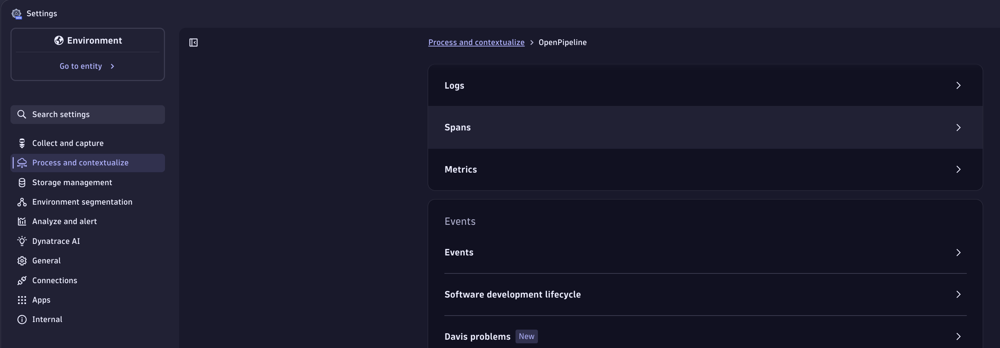

4. Click on the Pipelines tab and then create a new one with + Pipeline

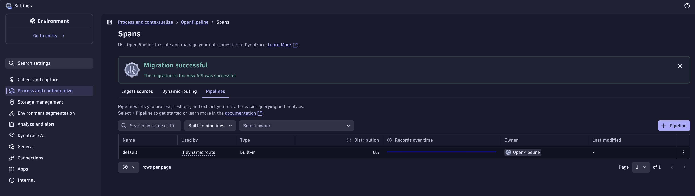

5. Create a metric extraction rule that grabs the dt.ingest.size field, and has the dt.security_context as dimension

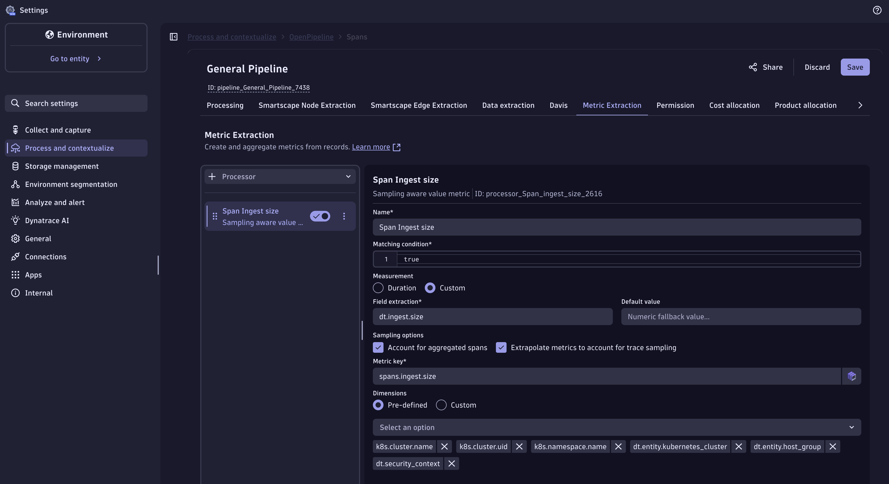

6. Go to the Dynamic Routing and create a new one with + Dynamic Route

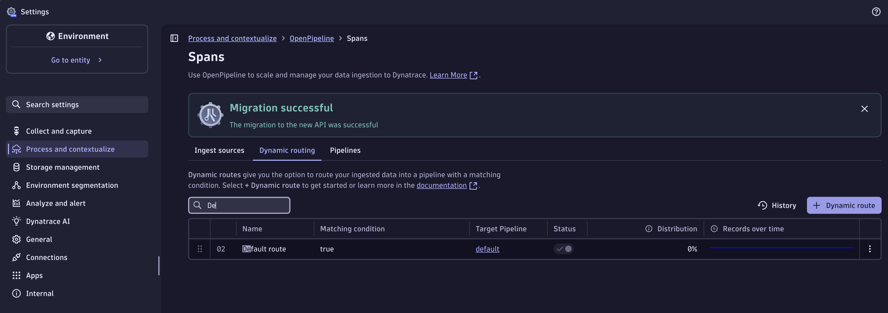

7. Route all the traffic to the respective pipeline

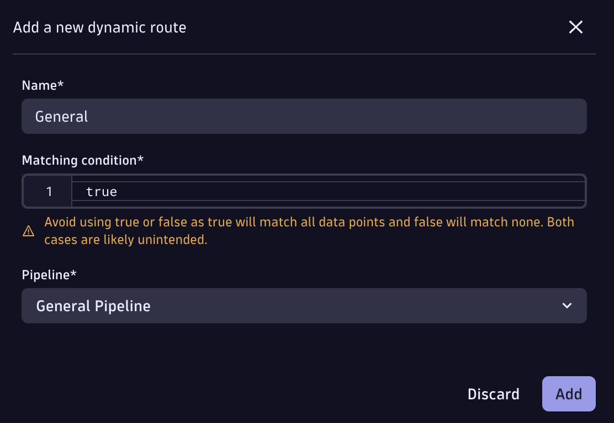

8. Go back to your Notebook and run the DQL of the `Spans Ingest a day per App` tile

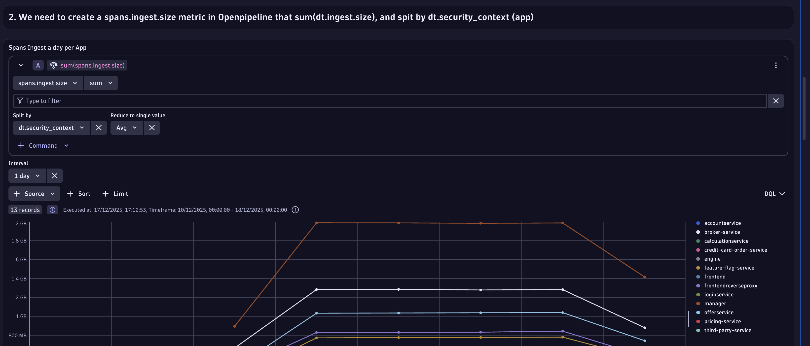

9. Run the `Avg/day Spans Ingest per App` tile

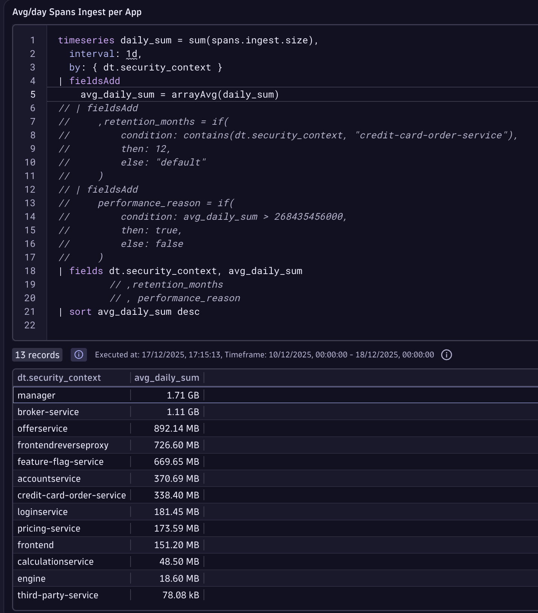

### Data Retention & Performance Requirements

Let's suppose a company requirement that is that Span of credit-card-order-service must be retained for 12 months for auditing and compliance (PCI DSS). Let's add it to the table, run this DQL

11. Click on Show Input, uncomment the first 2 commented blocks as it is shown in the picture
query and run it again

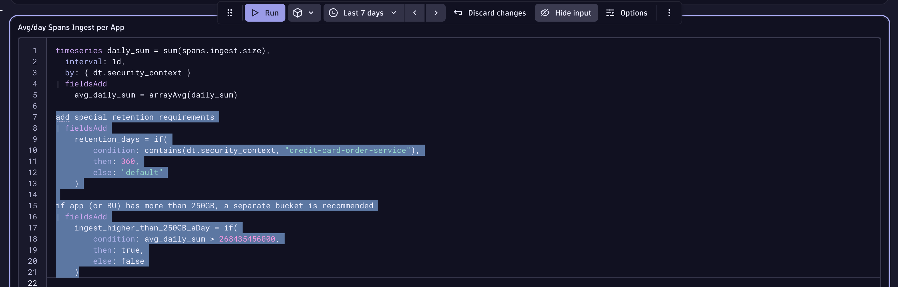

12. Uncomment the highlighted fields at the bottom of the DQL and run again

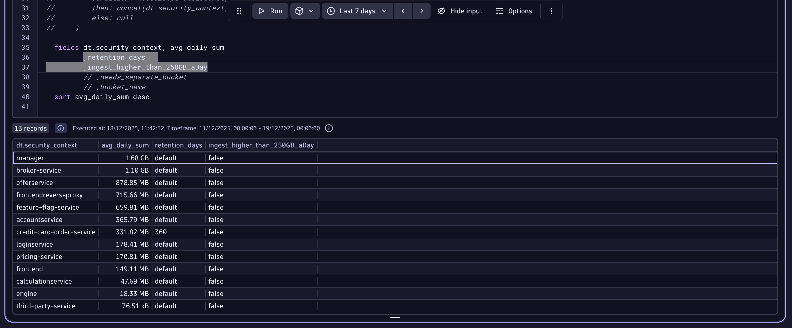

Now we should have a clear understanding on which apps need a separate bucket for data retention or performance reasons. For larger environments we could aggregate the numbers by a higher hierarchy, e.g. business unit. We will keep it simple for this exercise

### Bucket Tracking & Naming

This DQL helps track and understand the reason of custom buckets, we will columns to define the naming convention

13. Uncomment the remaining blocks of the DQL, and run again

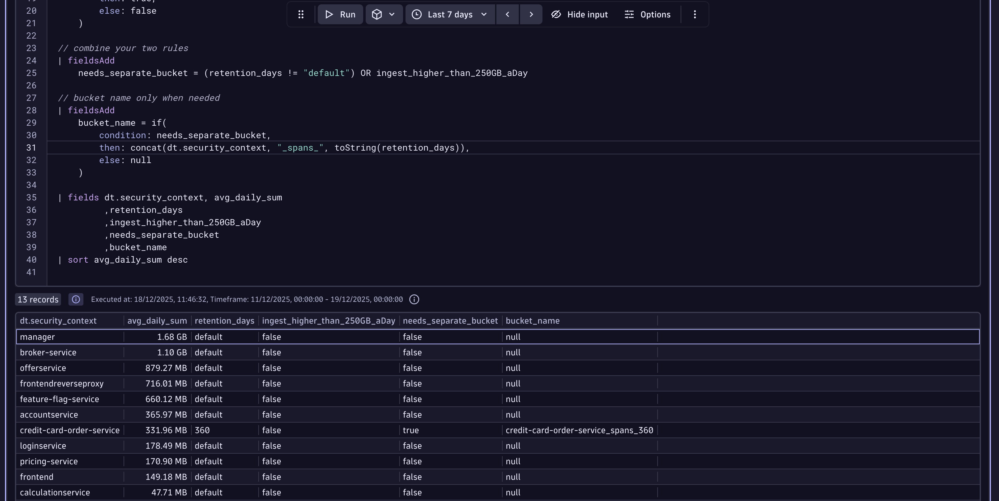

14. Copy the bucket name, go to Storage management setting and create a new bucket

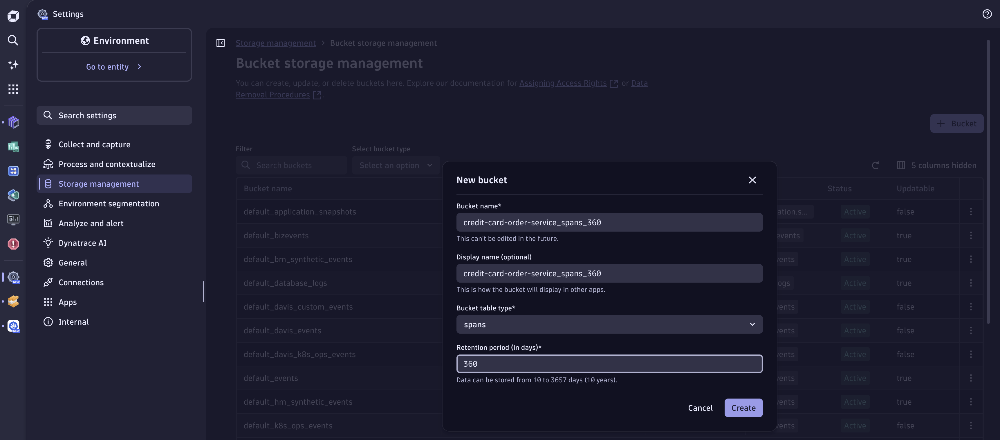

15. Go to the Spans Openpipeline, and open the "General Openpipeline" we've created before

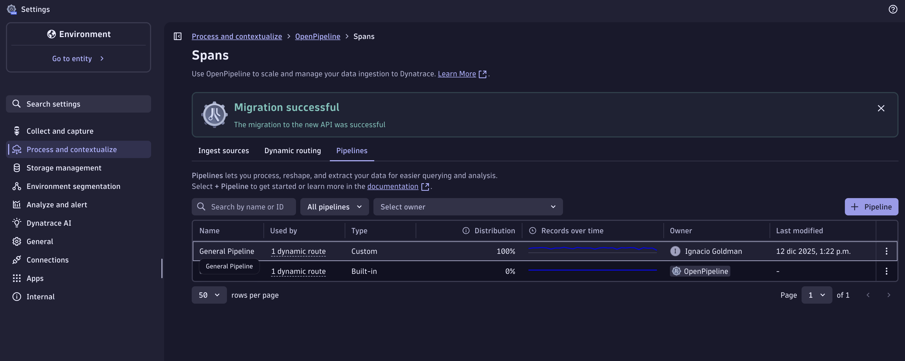

16. Create a storage processor to ruote all spans with dt.security_context = "credit-card-order-service" to the recently created bucket

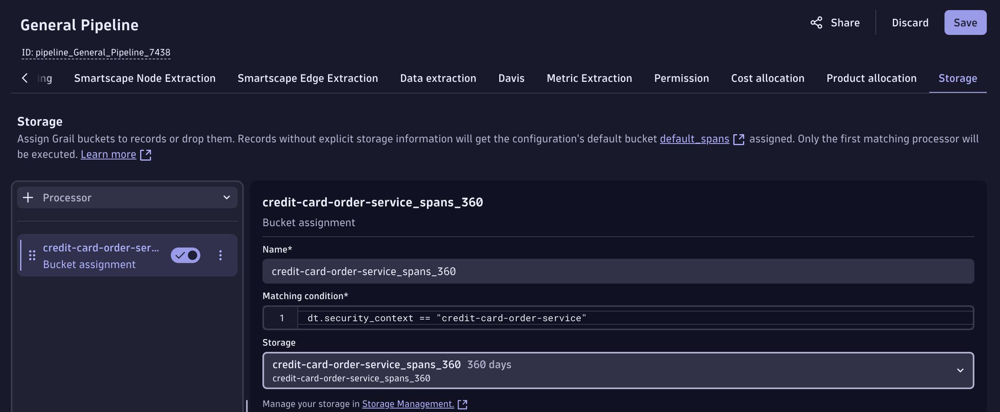

17. Validate traffic with our master Notebook

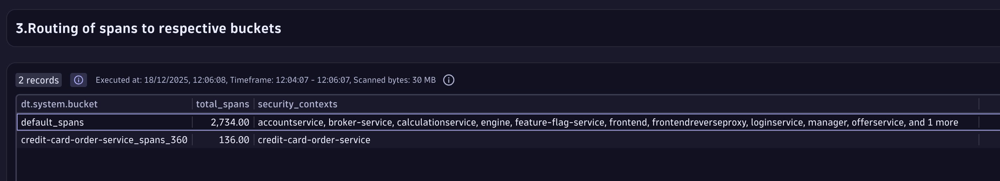

## Close Up

Well done! Now you have a separate bucket to meet Easytrade's requirements. 

You can apply the same steps for Logs, the Notebook provided will also guide you on how to do this same exercise for Logs. Not during the lab, but for you to take back and implement it in your organization.