## Data Segmentation

**Moving from Management Zones to Segments**

As Easytrade continues to scale, their observability data grows exponentially. Teams are struggling to filter logs, metrics, and traces efficiently. While Management Zones helped in the past, we don't want them in the future ;) .

Now, Easytrade is adopting Segments. They are a powerful new way to filter all types of data (not just entities) using dimensions like platform, app, and stage. These dimensions are already embedded in their Host Group definitions, and Segments will allow teams to slice data with precision, reduce noise, and improve performance.

Your goal in this lab is to help Easytrade build Segments based on their Host Group naming convention and validate their effectiveness across logs, traces, metrics, and dashboards.

### 🎯 Learning Objectives

- Understand what Segments are and how they differ from Management Zones.
- Learn how to extract dimensions from Host Group names.
- Create Segments for platform, app, and stage.
- Apply Segments to filter logs, traces, metrics, and dashboards.


#### Exercise 1: Understand Host Group Dimensions

Host Groups often encode key dimensions used for filtering. Let's get some context.

Easytrade uses the Host Group naming convention:
`k8s_multi_prod`

This encodes:
- platform → k8s
- app → multi
- stage → prod

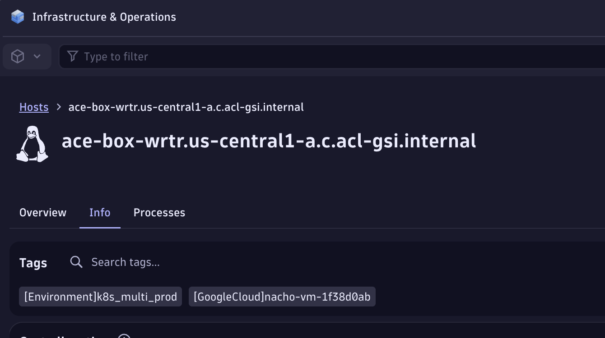
> Host Group definition

#### Exercise 2: Compare Management Zones with Segments

Management Zones filter entities. Segments filter everything. Let's have a look at both.

1. Open Dynatrace and view all hosts.
2. Apply a Management Zone filter.
3. Observe how only entities are filtered.

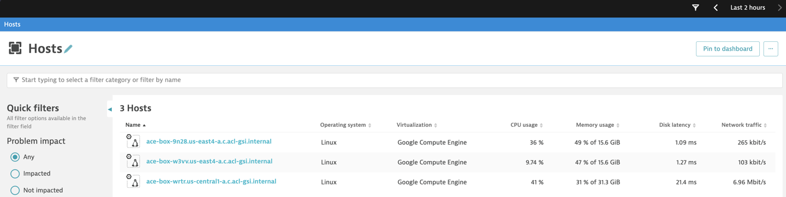
> All hosts within the environment

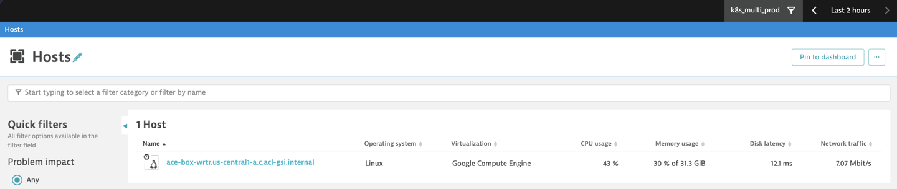
> Filtered by Management Zone

#### Exercise 3: Create a Platform Segment

Extract platform from Host Group names and use it to filter all data.

1. Go to Settings > Environment Segmentation > Segments
2. Create a Platform Segment with provided instructions.
    - Extract all possible values for Platform using the below DQL
        - ```fetch dt.entity.host_group| parse `entity.name`, """LD:platform '_' LD:app '_' LD:stage"""| dedup platform| fields platform```
    - Use `dt.host_group.id = $platform*` to filter all datapoints within the Host-Group


> Variable configuration

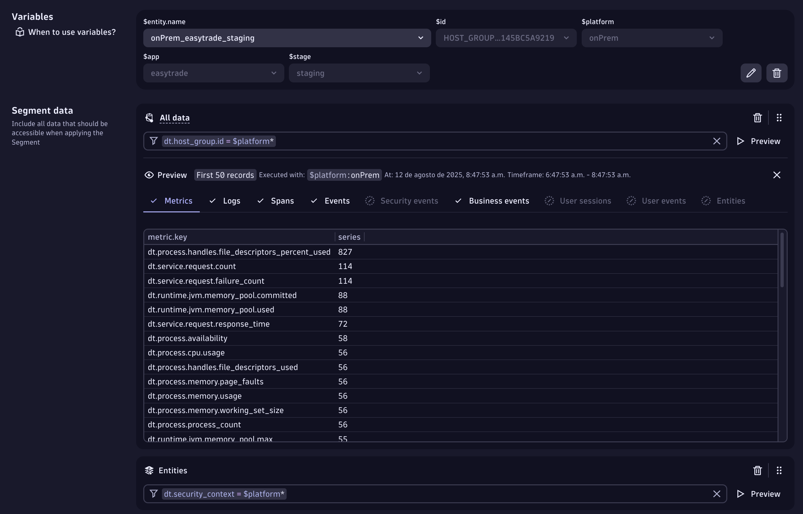
> Variable preview (filter)

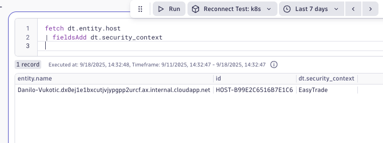
> Easytrade (security context based) segment for entities

#### Exercise 4: Create App & Stage Segments

Repeat the process for app and stage.

DQL for App

```sql
fetch dt.entity.host_group
| parse entity.name, """LD:platform '_' LD:app '_' LD:stage"""
| dedup app
| fields app
```

DQL for Stage

```sql
fetch dt.entity.host_group
| parse entity.name, """LD:platform '_' LD:app '_' LD:stage"""
| dedup stage
| fields stage
```

Segment Filters

App: `dt.host_group.id = *$app*`
Stage: `dt.host_group.id = $stage*`

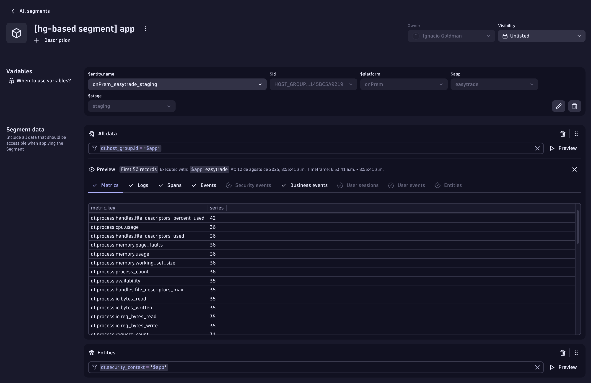
> App Segment configuration


> Stage Segment configuration

#### Exercise 5: Validate Segments with Logs

Use Segments to reduce noise in log queries.

1. Query logs without any Segment = more than 1000+ records.
2. Apply App Segment for easytrade.
3. Observe reduction in results.

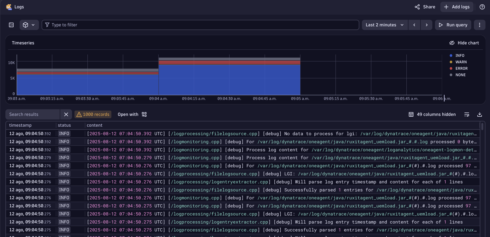
> Logs without Segment

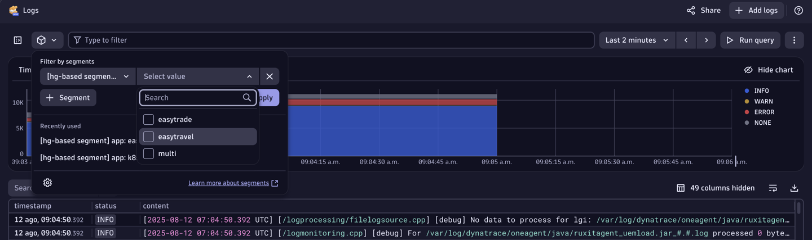
> Logs with App Segment

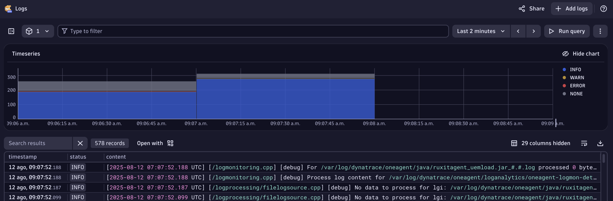
> Reduction in log records due to applied segment

#### Exercise 6: Validate Segments with Traces

Filter Distributed Traces using Segments.

1. Open Distributed Traces and filter for failed requests.
2. Apply Stage Segment (prod).
3. Observe filtered trace results.

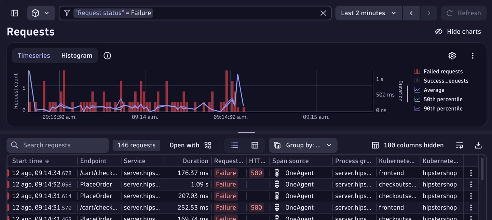
> Failed requests

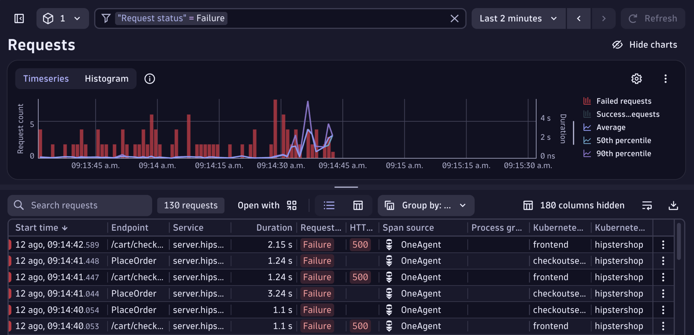
> Filtered traces

#### Exercise 7: Validate Segments with Metrics

Use Segments to scope dashboard tiles.

1. Use CoPilot to create a tile for CPU usage across hosts.
2. Apply Platform Segment (k8s) to the tile.
3. Observe scoped metric results.

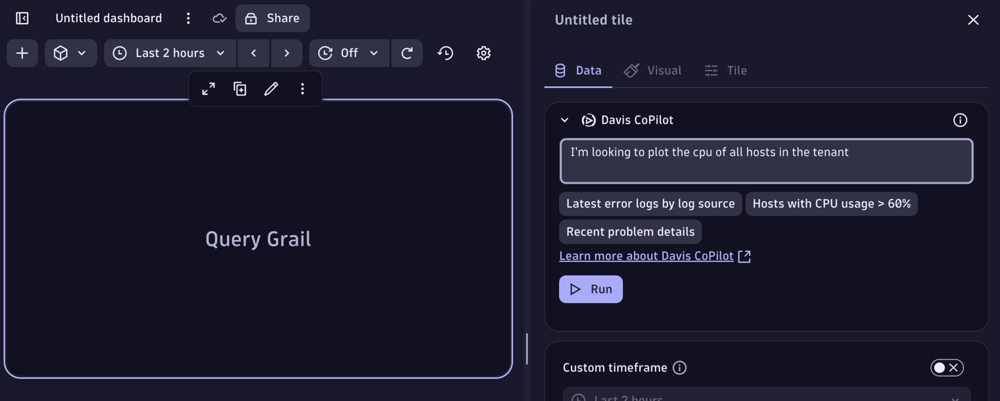
> Copilot tile

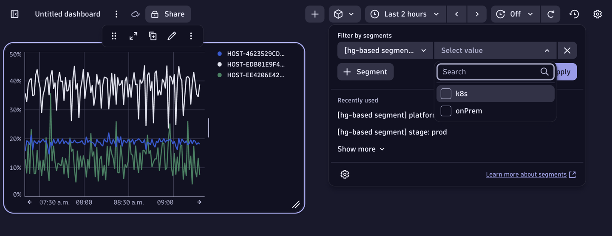
> Global dashboard segment applied

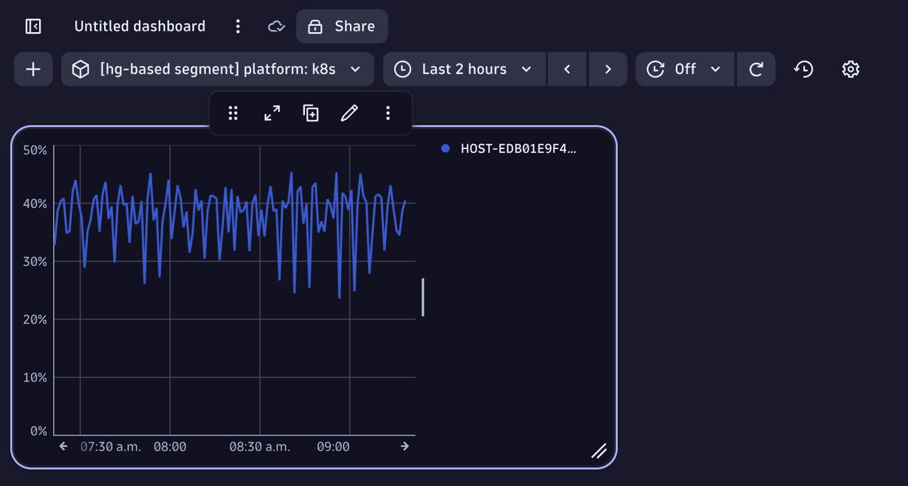
> Final dashboard view


OLD INSTRUCTIONS

### Learning Objectives

- Do segment based on host group, as explained here: https://dt-rnd.atlassian.net/wiki/spaces/d1coe/pages/1340474354/HG-based+Segments