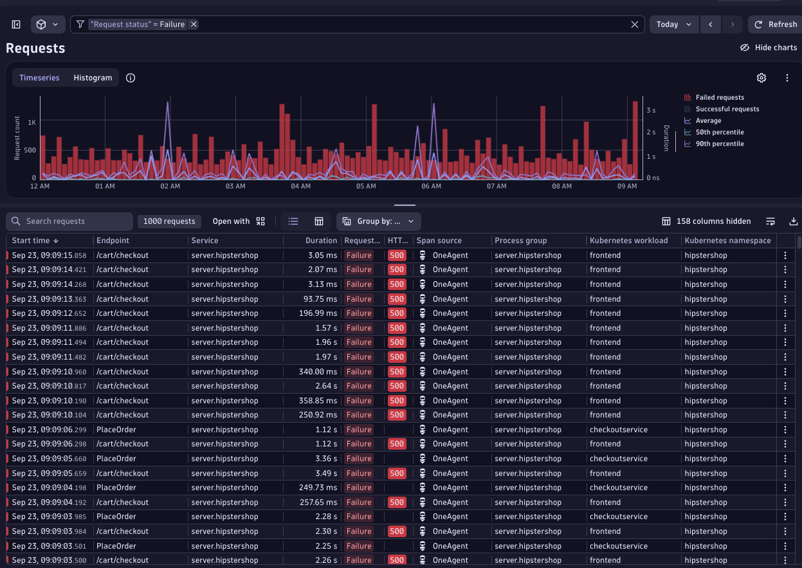
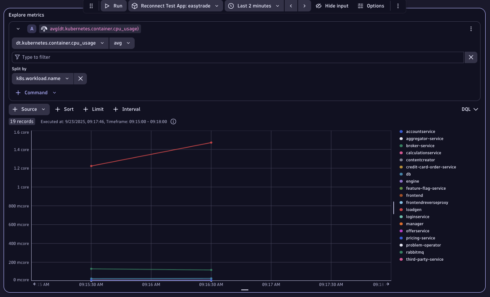

## Data Segmentation

**Moving from Management Zones to Segments**

As Easytrade continues to scale, their observability data grows exponentially. Teams are struggling to filter logs, metrics, and traces efficiently. While Management Zones helped in the past, we don't want them in the future ;) .

Now, Easytrade is adopting Segments. They are a powerful new way to filter all types of data (not just entities) using dimensions like platform, app, and stage. These dimensions are already embedded in their Host Group definitions, and Segments will allow teams to slice data with precision, reduce noise, and improve performance.

Your goal in this lab is to help Easytrade build Segments based on their Host Group naming convention and validate their effectiveness across logs, traces, metrics, and dashboards.

### 🎯 Learning Objectives

- Understand what Segments are and how they differ from Management Zones.
- Learn how to extract dimensions from Host Group names.
- Create Segments for platform, app, and stage.
- Apply Segments to filter logs, traces, metrics, and dashboards.


#### Exercise 1: Understand Host Group Dimensions

Host Groups often encode key dimensions used for filtering. Let's get some context.

Easytrade uses the Host Group naming convention:
`k8s_multi_prod`

This encodes:
- platform → k8s
- app → multi
- stage → prod


> Host Group definition

#### Exercise 2: Compare Management Zones with Segments

Management Zones filter entities. Segments filter everything. Let's have a look at both.

1. Open Dynatrace and view all hosts.
2. Apply a Management Zone filter.
3. Observe how only entities are filtered.


> All hosts within the environment


> Filtered by Management Zone

#### Exercise 3: Create a Platform Segment

Extract platform from Host Group names and use it to filter all data.

1. Go to Settings > Environment Segmentation > Segments
2. Create a Platform Segment with provided instructions.
    - Extract all possible values for Platform using the below DQL
        - ```fetch dt.entity.host_group| parse `entity.name`, """LD:platform '_' LD:app '_' LD:stage"""| dedup platform| fields platform```
    - Use `dt.host_group.id = $platform*` to filter all datapoints within the Host-Group


> Variable configuration


> Variable preview (filter)


Please note that filters such as `dt.host_group.id = $platform*` do not work for classic entities. You might get the following error if you try to apply the same filter to a `dt.entity.host` entity type - **"Wildcard "*" resulting in a "startsWith" operator not allowed, please change it in "dt.host_group.id" filter value definition.**". Please see below.


Nevertheless, this should work for smartscape 2.0 entities. Therefore, hosts should automatically be visible under the entities preview for "All Data" if the variable is set correctly(assuming it's enabled on the tenant). More information on how different classic and smartscape on grail entities are can be found [here](https://docs.dynatrace.com/docs/discover-dynatrace/platform/grail/smartscape-on-grail#differences-between-classic-entities-and-smartscape-on-grail).

#### Exercise 4: Create App Segment

Repeat the process for app and stage.

Variable DQL query for App

```sql
fetch dt.entity.cloud_application_namespace
| fields application_name = entity.name, tag = concat("app:", entity.name)
```

Segment Filters

App: `k8s.namespace.name = $application_name OR tag = $tag`


>Variable configuration for App segment


> App Segment configuration

#### Exercise 5: Validate Segments with Logs

Use Segments to reduce noise in log queries.

1. Query logs without any Segment = more than 10k+ records.
2. Apply App Segment for easytrade.
3. Observe reduction in results.


> Logs without Segment


> Logs with App Segment

#### Exercise 6: Validate Segments with Traces

Filter Distributed Traces using Segments.

1. Open Distributed Traces and filter for failed requests.
2. Apply App segment (easytrade).
3. Observe filtered trace results.


> Failed requests


> Filtered traces

#### Exercise 7: Validate Segments with Metrics

Use Segments to scope dashboard tiles.

1. Create a tile for k8s container CPU usage across workloads.
2. Apply App segment (easytrade) to the tile.
3. Observe scoped metric results.


> Global notebook segment applied


> Final dashboard view
