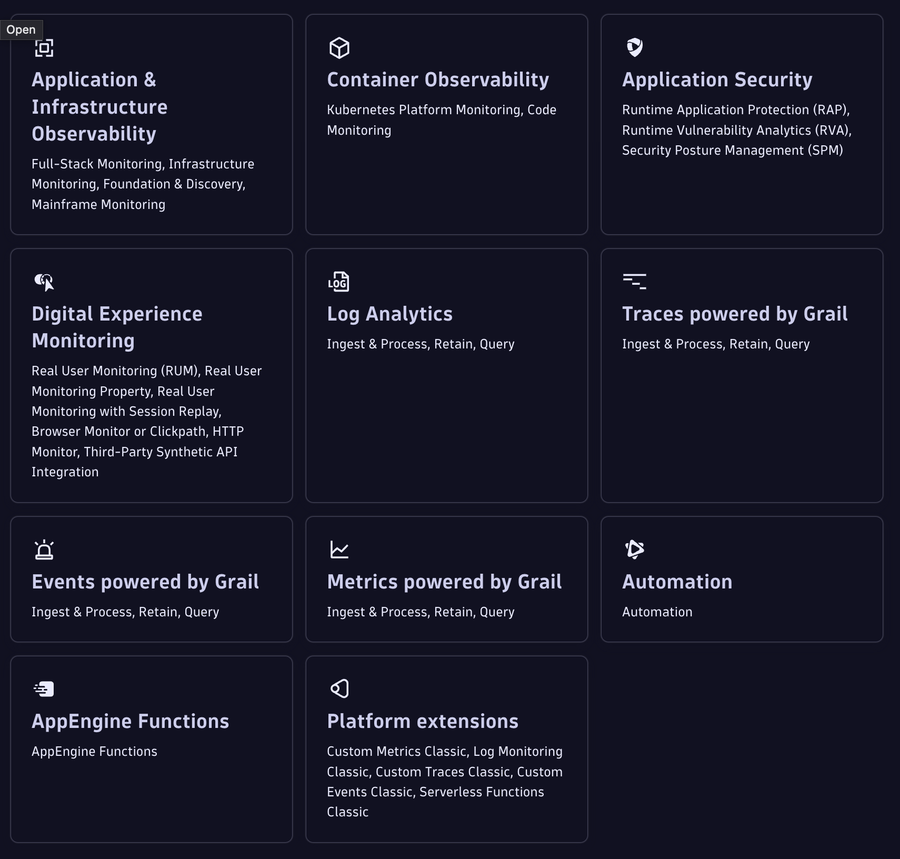
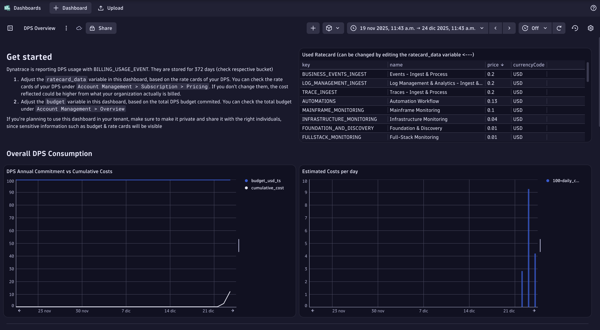
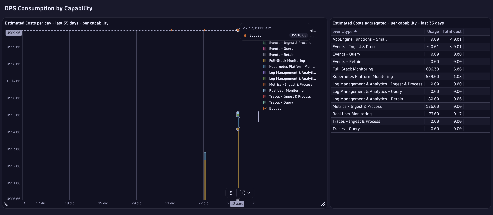
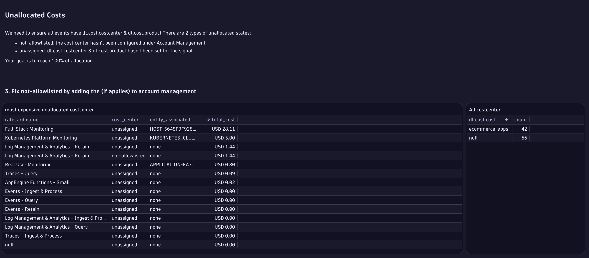
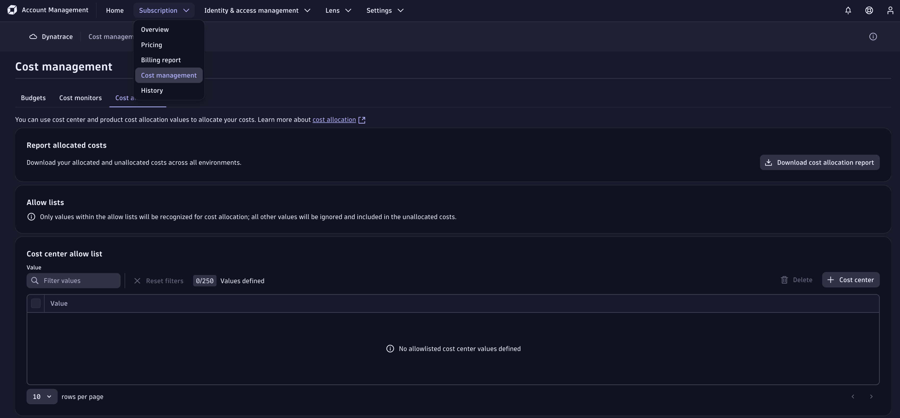
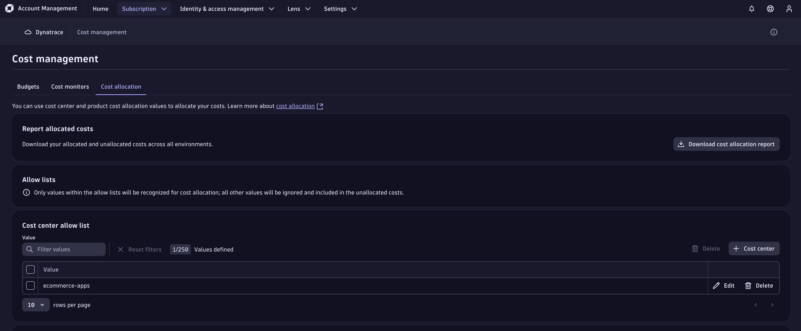
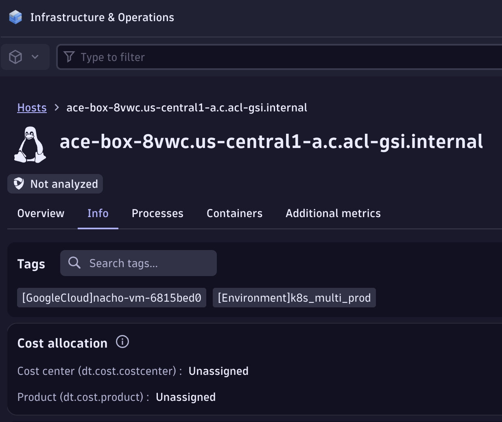
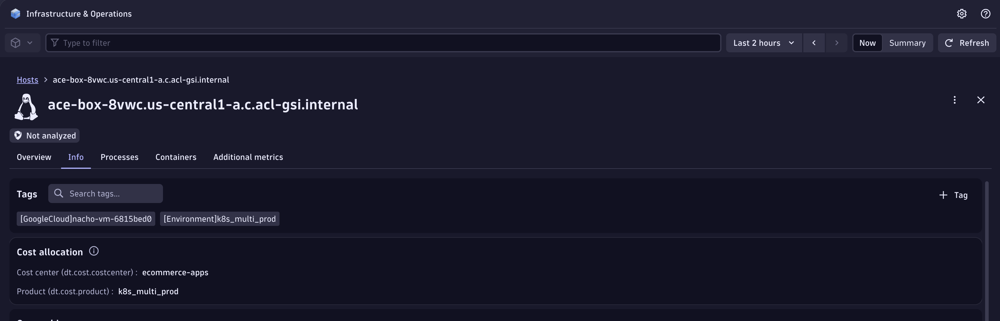
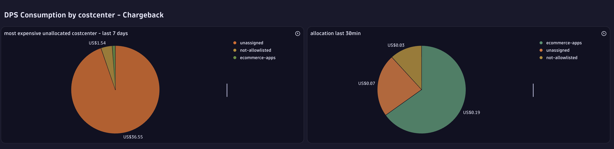

## Cost Allocation

### What is Cost Allocation?

Dynatrace Cost Allocation lets you allocate Dynatrace DPS usage to customer-defined cost centers, products, or both by enriching telemetry with two Grail attributes: `dt.cost.costcenter` and `dt.cost.product`. This gives you a transparent and detailed account of each cost center’s Dynatrace expenditures, helping your organization optimize its budgets. 

You first define the `Allow Lists` for valid values at Account Management(we'll see this later in the lab), then ensure these attributes are attached as data is captured (via OneAgent on hosts/pods, ingestion APIs, or OpenPipeline) so that billing usage events in Grail carry your allocations. [Dynatrace Docs](https://docs.dynatrace.com/docs/license/cost-allocation)

However, before allocating costs, let's start by understanding them.

### How does DPS work?

DPS empowers organizations to consume any Dynatrace capability, at any volume, at any time, under a single, transparent commitment. It’s designed to eliminate friction, simplify operations, and scale effortlessly with your business.

#### Features and benefits:
- **Simplicity**: One contract, one rate card, one platform. No SKU juggling. No surprises.
- **Scalability**: DPS scales with your needs—across modules, teams, and geographies.
- **Frictionless use**: No pre-allocation. No per-user costs. No overage penalties. Just use what you need, when you need it.
- **Transparency**: Real-time usage and cost visibility via Account Management and DPS APIs.
- **Flexibility**: Supports all deployments, trials, and evolving pricing models.

Each platform capability has a price point defined in the rate card that's included with your agreement. You will be able to see your DPS rate card under `Account Management > Subscription > Pricing` with Account Management permissions (there is no access to this during this lab). Example [default rate card](https://www.dynatrace.com/pricing/rate-card/).

#### How does DPS consumption work?

Dynatrace will consume based on the capabilities your organization is using, allowing your teams flexibility to focus on their needs. [Link](https://docs.dynatrace.com/docs/license/capabilities) to our documentation page.

#### Real world example

Let’s assume our application is running on an AWS EC2 VM. By installing the Dynatrace OneAgent, you will consume Full-stack monitoring (or Infrastructure Monitoring only if you choose not to enable APM).

If you enable log monitoring and distributed tracing, consumption is added under the respective Logs and Tracing capabilities. You can also enable Application Security and Digital Experience Monitoring (DEM) for the specific VMs or applications where you want deeper visibility into vulnerabilities and end-user experience.

This model spreads the charge across the capabilities you actually use. The advantage is full flexibility to enable or disable features based on team needs; however, because consumption is capability-based, it’s strongly recommended to implement cost allocation practices to track and control usage across teams and environments.

### Understand Costs

1. Let's have a look at the Dashboard "DPS Overview". What you'll find there is a breakdown of your DPS Consumption. Please note that you have a breakdown for the whole tenant as well as per capability.

2. Scroll down and check the consumption by capability

> Note: This view is available for everyone on Account Management. However, if you do not have Admin permissions within your company, you will not be able to see the breakdown. Therefore, here's a close example of how that would look like.

### Allocate Costs

Now that we've checked this on the account level, we need to make sure that costs are allocated to all dedicated teams regardless of what capability they are using. To do that, let's follow the next steps below:

1. Check if there's any cost center that hasn't been "allowlisted"

2. `ecommerce-apps` hasn't been allowlisted, let's add it in Account Management

3. After adding `dt.cost.costcenter`, you will be able to use the following chart to validate it. There's an event every hour that we can query.

4. The biggest portion of unallocated costs is because of Full-Stack monitoring. In our case, we are using a Kubernetes deployment in a [CloudNativeFullStack](https://docs.dynatrace.com/docs/ingest-from/setup-on-k8s/how-it-works/cloud-native-fullstack) monitoring mode. 
Dynatrace CloudNativeFullStack licensing is based on Host-level RAM, so we need to ensure that host properties are correctly set at the Host level in order for them to show up correctly on your chargeback report. These properties also align with the enrichment you completed earlier for cost allocation.

> Important Note: If you want a split Full-Stack monitoring costs on the namespace level, what you are looking for is Full-Stack Monitoring which combines [Kubernetes Platform Monitoring and Application-only monitoring](https://docs.dynatrace.com/docs/ingest-from/setup-on-k8s/deployment/application-observability). Licensing here is calculated based on pod-hours, plus the enrichment you’ve already applied in previous exercises - Lab 2a and 2b.

> Unassigned properties

5. We have already prepared a Dynakube with the relevant host properties for you to add. Run the following command to apply the Dynakube with the costcenter and cost product values.

`kubectl apply -f /home/ace/.ansible/collections/ansible_collections/ace_box/ace_box/roles/dt-operator/files/cloudNativeFullStack-properties.yaml`

6. Wait a few minutes until the cost center info appears

We can start allocating costs for ecommerce-app department

7. What about Logs/Metrics/Events? 

Telemetry data will already be enriched by the work you've done in Lab 2a and 2b. You can check your enrichment by fetching logs/metrics/spans and filtering for a `dt.cost.costcenter` or `dt.cost.product` of your choice.

That's the end of Part 1! Any questions?

