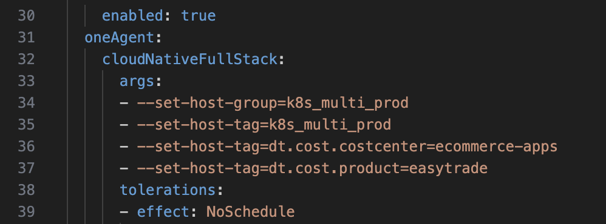
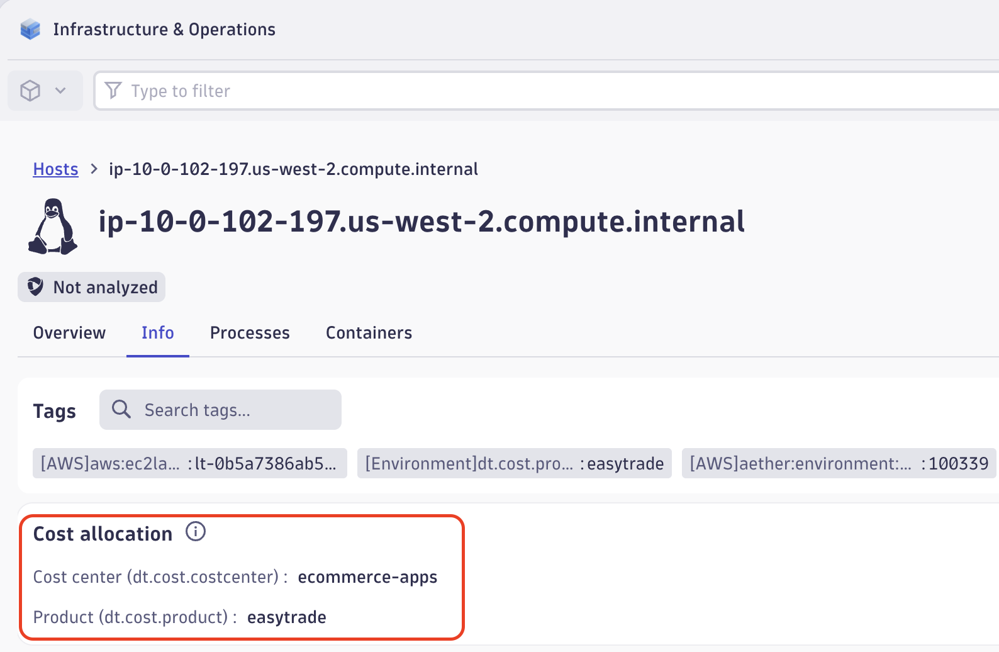
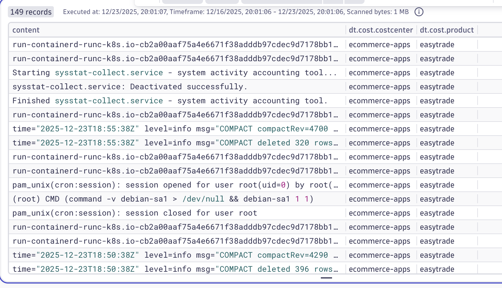
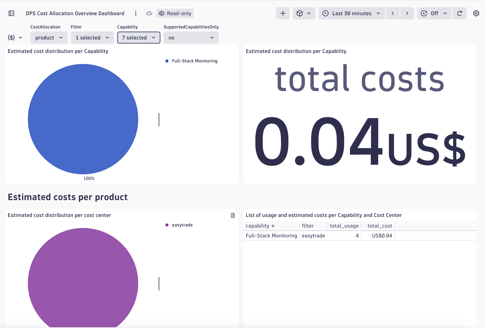

## Cost Allocation

### What is Cost Allocation?

_Dynatrace Cost Allocation lets you allocate Dynatrace DPS usage to customer-defined cost centers, products, or both. This gives you a transparent and detailed account of each cost center’s Dynatrace expenditures, helping your organization optimize its budgets._ - [Dynatrace Docs](https://docs.dynatrace.com/docs/license/cost-allocation)

Before Allocating Costs, let's start by understanding them.

### How DPS works?

Dynatrace’s model is predictable and volume-centric, which often results in lower total cost for large log volumes, compared to other observability tools.


In this particular example, we will assign this whole host to only 1 product and that is "easytrade".

What to do:
1. Run the following command that collects your current Dynakube with its configuration and exports it into a yaml manifest locally:
```bash
kubectl get dynakube dynakube -n dynatrace -o yaml > dynakube-export.yaml
```
2. Use vi/vim/nano to open the file and go to line where arguments are set for cloudNativeFullStack. Set the following arguments:



3. Exit and Save the manifest. Lastly, apply the updated manifest
```bash
kubectl apply -f dynakube-export.yaml
```
4. Wait a few mins and go to Infrastructure and Operations App and check your Node



Each platform capability has a price point defined in the rate card that's included with your agreement. You will be able to see your DPS rate cards under `Account Management > Subscription > Pricing` (no access to this during this lab). Example default rate card:


#### How consumption works?

Dynatrace will consume based on the capabilities your organization is using, allowing your teams flexibility to focus on their needs. [Link](https://docs.dynatrace.com/docs/license/capabilities) to doc.



#### Cloud VM example

Let’s assume our application is running on an AWS EC2 VM. By installing the Dynatrace OneAgent, you will consume Full-stack monitoring (or Infrastructure Monitoring only if you choose not to enable APM).

If you enable log monitoring and distributed tracing, consumption is added under the respective Logs and Tracing capabilities. You can also enable Application Security and Digital Experience Monitoring (DEM) for the specific VMs or applications where you want deeper visibility into vulnerabilities and end-user experience.

This model spreads the charge across the capabilities you actually use. The advantage is full flexibility to enable or disable features based on team needs; however, because consumption is capability-based, it’s strongly recommended to implement cost allocation practices to track and control usage across teams and environments.

### Understand Costs




2. Scroll down and check the consumption by capability


### Allocate Costs

3. Check if there's any cost center that hasn't been "allowlisted"


4. ecommerce-apps seems that hasn't been allowlisted, add it under Account Management


5. Add it, then you can use the following chart to validate, there's an event every hour


SCREENSHOT MISSING LAST TICKLE

6. The biggest portion of unallocation is because of Full-Stack monitoring. It is highly recommended to add those properties to your OA


7. We've ready for you a Dynakube with the relevant host properties to add. Run the following command to apply the dynakube with the costcenter value 

kubectl apply -f /home/ace/.ansible/collections/ansible_collections/ace_box/ace_box/roles/dt-operator/files/cloudNativeFullStack-properties.yaml

8. Wait a few minutes until the cost center info appears


We can start allocating costs for ecommerce-app department


