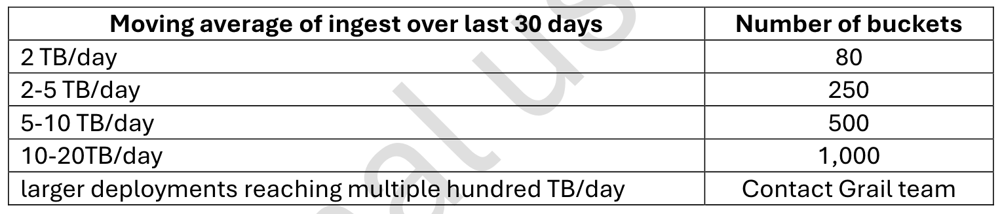

## Data Partitioning and Cost Allocation

Since easytrade is growing fast and multiple teams are accessing logs and metrics across environments, performance and cost are becoming critical concerns.
To stay ahead, Easytrade engineers need to implement a bucket strategy to optimize log storage and query performance. At the same time, they’re introducing cost allocation tagging to track usage across teams and applications.
This lab will guide you through designing a log bucket strategy and applying cost allocation metadata to a VM — helping Easytrade scale smart, not just fast.

### 🎯 Learning Objectives

- Understand how buckets impact data retention, query performance, and cost.
- Design a log bucket strategy based on ingestion volume and dimensions.
- Learn how to apply cost allocation metadata using `dt.security_context`, `dt.cost.product`, and `dt.cost.costcenter`.

### Data Partitioning – Bucket Strategy for Logs

Why do buckets matter?

- Data Retention: Controls how long logs are stored - main use!
- Query Performance: Targeted buckets reduce scan time.
- Cost Efficiency: Less scan = lower DQL costs.

You could technically rely on the default buckets, without creating custom ones. The advantage would be a reduced configuration management, but the drawback would be a decreased performance & costs. That’s the trade-off when desiging your bucket strategy.

Keep that in mind especially for small accounts, you don’t want to overcomplicate the solution. But for Enterprise accounts, a bucket strategy is required.

#### Examples

**Small scale customer ( < 2TB/day )**

If your customer has a low ingestion volume (e.g., less than 2 TB/day), they’ll likely operate within the default limit of 80 buckets per environment. In this case:
- Avoid creating too many buckets — especially at the team level.
- Instead, consider using record-level permissions within a few shared buckets.
- Focus on functional separation — split logs based on their purpose (e.g., infrastructure vs. application logs), rather than ownership.

This approach keeps configuration simple and avoids unnecessary overhead.

**Large scale customer (250-1000 buckets)**

For enterprise customers with higher ingestion volumes and extended bucket limits:

- A multi-bucket strategy becomes essential.
- Buckets should be designed to support:
    - Data retention policies
    - Query performance optimization
    - Cost control
    - Access control per team or business unit

Use meaningful dimensions like `app`, `business_unit`, or `stage` to partition logs. 

> 💡 Remember: Custom buckets are primarily designed for data retention, but they also play a key role in access control and cost efficiency.

#### Exercise 1: Analyze Ingestion Volume

Use dimensions like app, stage, or team to estimate log volume.

Review the customer’s log ingestion volume per app. You can do that by fetching all logs for your k8s cluster and then applying any of the created segments that will lower the result size as well as improve the performance.

#### Exercise 2: Design Bucket Strategy

Choose the right dimension to partition logs - in this case, we can go with the namespace name.

1. Go to Settings > Storage Management 
2. Click on "+Bucket"
3. Create a new custom bucket for easytrade logs and choose your retention
4. Go to Settings > Process and Contextualize > Logs 
5. Add a new dynamic routing rule with a route = `k8s.namespace.name == "easytrade"`
6. Add a new pipeline and in the last stage of the pipeline, add the bucket asignment rule.
7. Fetch the logs again and check that your rule works.

# -TO-DO

#### Exercise 3: Connect Buckets to Access Control

Use IAM to restrict log access by bucket.

#### Exercise 4: Cost Allocation – Tagging a VM

- Step 1 Cost center allow list - https://docs.dynatrace.com/docs/license/cost-allocation#cost-allocation-allowlist
- Step 2 configure host properties with remote connection - https://docs.dynatrace.com/docs/license/cost-allocation#big-steps--auto--1--Configure-Cost-Allocation-on-the-host
- explain that for k8s we have already done it with taks 2 and 3 in lab 2
- Download a dashboard - https://guu84124.apps.dynatrace.com/ui/document/v0/#share=96fef674-3349-470b-80a0-80d98765864d
- Upload it to their personal tenant
